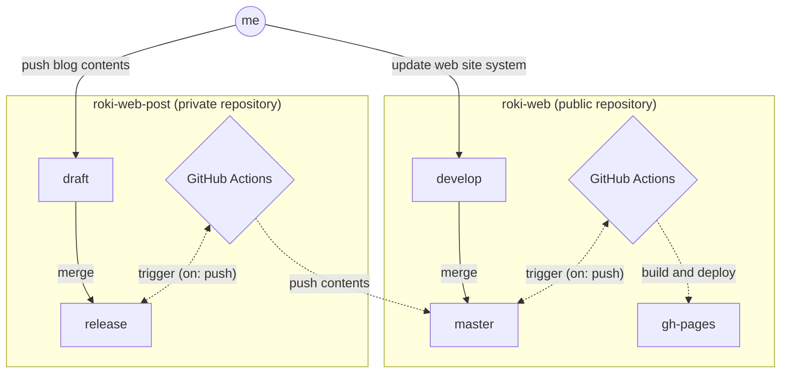

<h1 align="center">roki-web</h1>
<p align="center">:memo: The <a href="https://github.com/falgon">roki</a>'s website and blogs</p>

| CI | Deployment | Inspection | Quality | PR check |
| :--: | :--: | :--: | :--: | :--: |
| [](https://github.com/falgon/roki-web/actions/workflows/build.yml) | [](https://github.com/falgon/roki-web/actions/workflows/pages/pages-build-deployment) [](https://dl.circleci.com/status-badge/redirect/gh/falgon/roki-web/tree/develop) | [](https://snyk.io/test/github/falgon/roki-web?targetFile=package.json) [](https://app.fossa.com/projects/git%2Bgithub.com%2Ffalgon%2Froki-web?ref=badge_shield) | [](https://www.codefactor.io/repository/github/falgon/roki-web) [](https://www.codacy.com?utm_source=github.com&amp;utm_medium=referral&amp;utm_content=falgon/roki-web&amp;utm_campaign=Badge_Grade) [](https://codeclimate.com/github/falgon/roki-web/maintainability) | [](https://dl.circleci.com/status-badge/redirect/gh/falgon/roki-web/tree/develop)[](https://github.com/falgon/roki-web/actions/workflows/build_pr.yml) |

* **Website**: [roki.dev](https://roki.dev)
   * Tech blog: [roki.dev/roki.log](https://roki.dev/roki.log/)
   * Diary: [roki.dev/roki.diary](https://roki.dev/roki.diary/)

## Setup

```sh
git clone --recursive git@github.com:falgon/roki-web.git && cd roki-web
nvm install && nvm use && npm i
stack build
```

## Usage

Building the site
```sh
stack exec site -- --help
Usage: site [--version] [--preview] [-v|--verbose] [--internal-links] COMMAND
  The static site roki.dev compiler version 0.1.0.0 powerted by Hakyll

Available options:
  -h,--help                Show this help text
  --version                Show version
  --preview                Enable a preview flag
  -v,--verbose             Run in verbose mode
  --internal-links         Check internal links only

Available commands:
  build                    Generate the site
  check                    Validate the site output
  clean                    Clean up and remove cache
  deploy                   Upload/deploy roki.dev
  rebuild                  Clean and build again
  server                   Start a preview server
  watch                    Autocompile on changes and start a preview server

stack exec site -- build --preview # fast build (This does not render KaTeX)
stack exec site -- build # release build
```
Scheduled posting
```sh
stack exec spa -- --help
Usage: spa [--version] COMMAND [-d|--date date] [-b|--branch-name ARG] [-y]
  The roki-web Scheduling Post Action manager 0.1.0.0

Available options:
  -h,--help                Show this help text
  --version                Show spa version information
  -d,--date date           Date to schedule (mm-dd-%H:%M)
  -b,--branch-name ARG     The name of the branch you plan to deploy
  -y                       Generate a file without checking the branch name and
                           repository name

Available commands:
  cexpr                    show crontab expression
  yaml                     generate GitHub Actions yaml from template
  clean                    clean up and remove cache

stack exec spa -- cexpr -d $(date "+%m-%d-%R") # from current time
00 15 11 09 *
stack exec spa -- yaml -d $(date "+%m-%d-%R") -b my-awesome-scheduled-post # from current time
current branch name is: draft
Are you sure you want to continue? (y/N)y
Initialising...
  Creating store...
  Creating provider...
  Running rules...
Checking for out-of-date items
Compiling
  updated tools/scheduled_post/template.yml
  updated my-awesome-scheduled-post.yml
Success
mv .github/workflows/scheduled/my-awesome-scheduled-post.yaml .github/workflows/ && rmdir .github/workflows/scheduled # apply
```

[docker documentation here](./docker/README.md)

## System overview

### Overview of blog posts and website system updates



* [roki-web](https://github.com/falgon/roki-web) (this repository)
* [roki-web-post](https://github.com/falgon/roki-web-post) (private repository)

[GitHub Actions for GitHub pages](https://github.com/peaceiris/actions-gh-pages)
has been very helpful in building this system. 
Thanks for it.

### Overview of preview function accompanying PR

<p align="center">

</p>

When PR is issued, artifact is built on CircleCI as shown above and it is possible to preview.
Also, the bot [@kiirotori](https://github.com/kiirotori) will add a comment containing the URL of the preview site and the URL of the circleci JOB log that can be displayed in the artifact.

## History

This is a project for a new website that integrates the following two sites.

* [Roki Profile](https://falgon.github.io/roki/)
    * Repo: <https://github.com/falgon/roki>
* [roki.log](https://falgon.github.io/roki.log/)
    * Repo: <https://bitbucket.org/r0ki/roki.log/> (private)
    * Repo (gh-page): <https://github.com/falgon/roki.log>

These two will be discontinued in the future and replaced by this new website and
have the following characteristics.

* The website [Roki Profile](https://falgon.github.io/roki/) is deployed manually (maintained by snyk-bot)
* The blog [roki.log](https://falgon.github.io/roki.log/) is deployed bitbucket-pipelines 

I used bitbucket, a kind of Git service that I can use private repositories for free, 
because github couldn't use private repositories for free before.
But times have changed and now private repositories are now available for free and 
native CI (GitHub Actions) are also available.
In this project, I use [Hakyll](https://jaspervdj.be/hakyll/), which is a static site generator, 
to manage the frontend library with node.js and have it managed with synk-bot. 
Deployment is done with github actions, drafts of blog posts are managed in another repository, 
and commits to a specific branch in that repository are triggered and pushed to this branch.
This makes it possible to make open source and keep drafts private, 
improving and integrating the previously separated management form.

## License [](https://app.fossa.com/projects/git%2Bgithub.com%2Ffalgon%2Froki-web?ref=badge_small)

Licenses of this project is managed by [FOSSA](https://fossa.com/) (you can see above "license scan" badge).
For more details, you can see [the dependency report of FOSSA](https://app.fossa.com/projects/git%2Bgithub.com%2Ffalgon%2Froki-web?utm_source=share_link).

<div align="center">
   
[](https://app.fossa.com/projects/git%2Bgithub.com%2Ffalgon%2Froki-web?ref=badge_large)
</div>
