少し時間が経ってしまったのですが,
2022 年の 10 月末頃に[キャメルゴルフ＆ホテルリゾート](https://www.camel-golf.com/)という千葉県夷隅郡御宿町にある施設にて
1 泊 2 日のグランピングをしてきました.
思い出が忘却の彼方となってしまわないうちに, その体験記を記したいと思います.

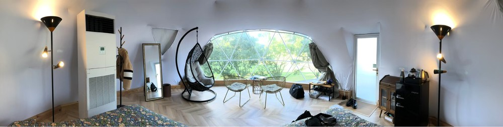{ width=1000px }

なおグランピングとは,
グラマラス (魅惑的な) とキャンピングを掛け合わせた造語で,
テント設営や食事の準備などの煩わしさから旅行者を解放する「良い所取りの自然体験」に与えられた名称です.
最近は多くのメディア露出もあることから広く認知された言葉となっていますね⛺

## キャメルゴルフ＆ホテルリゾートとは

キャメルゴルフ＆ホテルリゾートは千葉県夷隅郡御宿町にある,
元プロゴルファージャンボ尾崎氏監修のもと設計された丘陵コースがメインのゴルフ施設で,
その立地を活かした様々なタイプの宿泊が楽しめるスポーティなリゾート施設です.

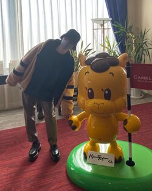{ width=250px }

ゴルフの他にも様々な遊具やアクティビティ,
キッズルーム等の子ども向け施設があり子ども連れでも安心できるほか,
大浴場やリラクゼーションサロン,
コンペルームなど, 目的に合わせた休暇が満喫できる施設となっていました.  
筆者としては, 通常のゴルフの他に「フットゴルフ」も同施設内でプレーできることが印象的でした.
筆者は学生時代までとあるクラブチームでサッカーをしていたものの,
恥ずかしながらフットゴルフという競技をこの機会で初めて知りました.

> サッカー（フットボール）とゴルフ、この異なるスポーツを融合した新しいスポーツがフットゴルフです。サッカーボールの5号球を使い、ゴルフコースで9ホール、または18ホールをラウンド。「サッカーボールを蹴ってゴルフをする」ことをイメージすると分かり易いでしょう。―― *[フットゴルフとは？ | 一般社団法人日本フットゴルフ協会](https://www.jfga.jp/aboutfootgolf)*

しかも,
同施設にあるフットゴルフのコースはあの世界的サッカー漫画「キャプテン翼」の原作者である高橋陽一先生監修の元に設計されているとのことで,
施設内の随所に「キャプテン翼」コーナーや高橋洋一先生デザインの像が設置されており,
ファンへの粋なはからいを感じる設計となっています.

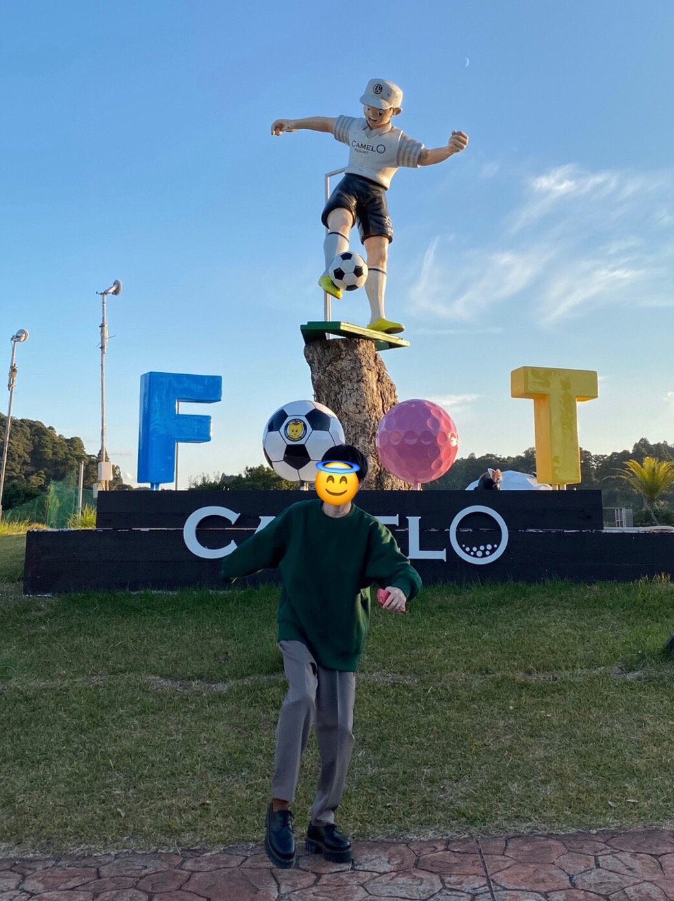{ width=250px }

サッカー経験者であればなおのこと, これはちょっと一度やってみるか！という気持ちになると思うのですが,
フットゴルフについて詳しく調べてみたところ, 既定の服装, 所謂ドレスコードというものが定められていることを知り,
今回はそのような準備もなかったため断念しました.

> どんな格好でプレーするの？  
> まず、コースに来場する際は、そのコースのドレスコードを遵守してください。ジーンズやサンダル、タンクトップ、Tシャツでのご来場は厳禁です。またプレーする際は、襟付きのシャツ、ゴルフ用のパンツ（ショートパンツ）、ハイソックスの着用をお願いしております。――  *[一般社団法人日本フットゴルフ協会公式サイト | Q&A](https://www.jfga.jp/faq)*

...というように, 同施設のメインは無論ゴルフではあるのですが
特にゴルフをするということもなく
今回は同施設のグランピングを楽しんできました.

<article class="mb-3 mt-3 message is-info">

<i class="fas fa-info-circle"></i> :point_right:
<a href="https://px.a8.net/svt/ejp?a8mat=3T2BM8+DWPKJ6+1OK+BW8O2&a8ejpredirect=https%3A%2F%2Fwww.ikyu.com%2FikCo.ashx%3Fcosid%3Da8ikyu%26surl%3Dhttps%253A%252F%252Fwww.ikyu.com%252F00001932%252F" rel="nofollow">キャメルゴルフ＆ホテルリゾートの宿泊予約はコチラ</a>

</article>

<!--more-->

## 交通手段

冒頭で示したとおり, 同施設は千葉県夷隅郡御宿町にありその周辺は山々に囲まれた立地となっているため,
最も一般的な交通手段としては車移動が挙げられるのではないかと思います[^1].

<iframe class="is-absolute" src="https://www.google.com/maps/embed?pb=!1m14!1m8!1m3!1d26080.126528946064!2d140.314894!3d35.206075!3m2!1i1024!2i768!4f13.1!3m3!1m2!1s0x603d4af9815fa621%3A0xf8b11c640dc59d16!2z44Kt44Oj44Oh44Or44K044Or44OV77yG44Ob44OG44Or44Oq44K-44O844OI!5e0!3m2!1sja!2sjp!4v1676438162245!5m2!1sja!2sjp" width="600" height="342" style="border: 0; top: -25vw; left: 0; width: 100%; height: 25vw;" allowfullscreen="" loading="lazy" referrerpolicy="no-referrer-when-downgrade"></iframe>

しかしながら
筆者はここ最近運転しておらずペーパー状態だったし
馴れない道での運転で疲れてしまうことを懸念して公共交通機関で向かうこととしました.
この場合, 施設に最も近い駅である**御宿駅**まで外房線で向かい, そこからタクシー (片道約 13 分, 約 3,000 円程度)
乗車という手段が楽でしたので, この方法で向かいました.
京葉線・外房線間は御宿駅で停車する特急「わかしお」が動いていますので,
これを利用し東京駅からゆったりと向かいました.

」 9 号と筆者, 御宿駅にて](./wakashio_with_me.jpg){ width=400px }

なお, この記事の執筆時点では該当地域において
[Go:taxi:](https://px.a8.net/svt/ejp?a8mat=3T2D6X+CDXOVM+4HGS+5ZMCI)
といったタクシーアプリの対応範囲外となっていましたので,
事前に周辺地域のタクシー会社に予約を入れ, スムーズに向かえるよう準備しました. 
ところで, この**キャメル**ゴルフ＆ホテルリゾートという名称もそうですし,
御宿駅の観光案内所の看板や近隣の御宿海岸に立つ像など,
至るところでラクダが散見されるのでなにか共通の理由があるのかなと調べてみたのですが,
諸説あるものの,
どうやら童謡「月の沙漠」のモデルが御宿の海岸であるからということのようでした[^3]:camel:

## 設備

今回, 私は一休という宿泊予約サイトで
室内 28 平米, ウッドデッキ 88 平米ドームテントのプランを予約しました.
同様のプランは下記一休のウェブサイトから予約できます.

<article class="mb-3 mt-3 message is-info">

<i class="fas fa-info-circle"></i> :point_right:
<a href="https://px.a8.net/svt/ejp?a8mat=3T2BM8+DWPKJ6+1OK+BW8O2&a8ejpredirect=https%3A%2F%2Fwww.ikyu.com%2FikCo.ashx%3Fcosid%3Da8ikyu%26surl%3Dhttps%253A%252F%252Fwww.ikyu.com%252F00001932%252F%253Fadc%253D1%2526lc%253D1%2526pln%253D11076156%2526ppc%253D2%2526rc%253D1%2526rm%253D10203645%2526si%253D1%2526st%253D1" rel="nofollow">ドームテント (グランピング) -2食付- お夕食は natural BBQ！ 移動用バギーカート付き | キャメルゴルフ＆ホテルリゾート </a>

</article>

ゴルフコースに沿う形で高床式のウッドデッキの上にドームテントが立っており,
ウッドデッキには専用の洗面台にトイレ, ハンモック, BBQ セット/スペースがついています.
ゴルフコース周辺という環境 $\times$ 高床式テントは,
自分たちの居住圏を広く感じられる組み合わせです.
辺りを遮るものもなくとても良い景観と開放感で, 正にグランピングの言葉に相応しいグラマラスな環境でした.
それでいながら, 
隣のテントとは比較的離れており,
プライバシーも十分に確保されていました.
今回宿泊した位置がたまたま一番端であったことも幸運でした.

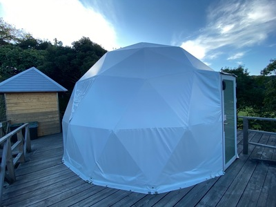{ width=400px }

室内の景観は冒頭の画像のとおりです.
画像の左から順にランプ, 冷暖房装置, 全身鏡, ハンギングチェア,
椅子x2, テーブル, ケトル/ランタン/コーヒーセット等の食器類が収められた棚,
冷蔵/冷凍庫というように配置されています.
ベッドはダブルベッドがツインになっており, 大人が大の字で寝ることができます.

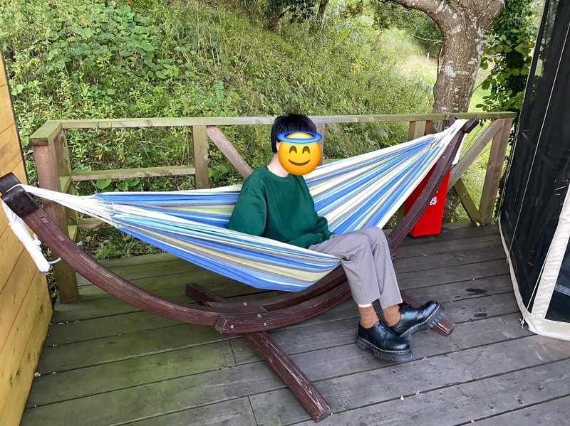{ width=400px }

他, いま紹介したものも含め下記のものが準備されており,
全体的にアメニティ類はかなり充実していました (なにか足りないものがあれば,
フロントに電話をかけ相談することもできる).

<table style="border: solid 1px #dbdbdb;">
<tbody>
<tr><td>シャンプー・リンス</td><td>ボディーソープ・石鹸</td><td>タオル・バスタオル</td></tr>
<tr><td>歯磨きセット</td><td>くし・ブラシ</td><td>シャワーキャップ</td></tr>
<tr><td>ドライヤー</td><td>髭剃り</td><td>シェービングジェル・フォーム</td></tr>
<tr><td>浴衣</td><td>ナイトウェア</td><td>バスローブ</td></tr>
<tr><td>スリッパ</td><td>洗顔料</td><td>化粧水</td></tr>
<tr><td>乳液</td><td>メイク落とし</td><td>綿棒</td></tr>
<tr><td>コットン</td><td>冷蔵庫</td><td>湯沸しポット</td></tr>
<tr><td>お茶セット（無料）</td><td>テレビ</td><td>金庫</td></tr>
<tr><td>ズボンプレッサー</td><td>DVDプレイヤー</td><td></td></tr>
</tbody>
</table>

wifi も完備されていましたが速度的なところは (計測等したわけではありませんが)
ネットサーフィン中, 何度かタイムアウトしたりする等, 体感的には少しイマイチでした.
キビキビとネットサーフィンがしたければポケット wifi
等を持ち込んだ方が良いでしょうが,
このような自然溢れる場所ではきっと画面を見る気も失せ,
体を動かしたくなるでしょうし問題ないでしょう:+1: 
なお, 
今回は下図の Bluetooth スピーカーを持参し,
YouTube の音楽ライブストリーミングを垂れ流していたのですが,
ちょこちょこ止まったりはしていたものの, 許容範囲内という感じでした.

, 防水性能がありアウトドアに最適](./anker_sound.jpg){ width=400px }

BBQ や天体観測, コーヒータイム等, その時々に最適な BGM があると,
よりそのシーンに耽って楽しむことができますよね.
今回の体験でこれを持ち込み, 大正解だったことを体感できた筆者としては,
グランピングの際の必需品として Bluetooth スピーカーを挙げたいと思います.
無論, ドームテントへの防音効果は期待できませんし, 施設によってはお隣さんと近くだったりするかと思いますので,
**周囲へ気を配り迷惑とならないようマナーを守って利用することが必須**です.
決して, 爆音で EDM 等を流してディスコしてはなりません🙄

  
余談はさておき,
今回予約したプランはバギーカート付きとなっており,
施設ロビーから自分たちの宿泊テントまでバギーカートを運転して移動することができるようになっていました[^2].
これは, ゴルフ場でもあるというこの施設ならではの体験であり,
筆者にとっては同コース予約者としての特典アトラクションという感じで楽しめました.

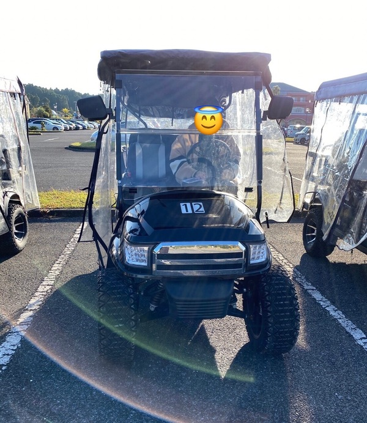{ width=300px }

また, これは設備というわけではないかもしれないですが,
<a href="https://px.a8.net/svt/ejp?a8mat=3T2BM8+E9T3UA+25KS+63WO2" rel="nofollow">cake.jp</a>
というケーキを注文して指定施設に送り届けさせることのできるサービスがあり,
このキャメルゴルフ＆ホテルリゾートは同サービスに対応とのことで,
今回は筆者の連れの者がちょうど誕生日だったこともあり利用しました.

<article class="mb-3 mt-3 message is-info">

<i class="fas fa-info-circle"></i> :point_right:
<a href="https://px.a8.net/svt/ejp?a8mat=3T2BM8+E9T3UA+25KS+63WO2" rel="nofollow">cake.jp</a>

</article>

様々な種類のケーキを選択できる他,
指定画像のケーキへのプリント等, 
普通とは違うオリジナリティのあるケーキにしたいと思っていた筆者にとっては助かるサービスでした.
なにより, 宿泊先まで自身で持ち込む必要がなく,
フロントでただ受け取れば良いだけというのがとても楽でしたので, 今後も同様の機会がありましたら利用したいなと思っています.

## 夕食

キャンプ/グランピングの中でも重要, そして醍醐味的な体験の
1 つは, なんといってもその自然環境に包まれながらの夕食だと思います.
今回筆者が宿泊したプランではウッドデッキの BBQ スペースで BBQ ができるというもので,
さらに食材や調理方法等があらかじめすべて準備されているという
怠惰な筆者にとっては非常に楽でありがたい
内容となっていました.

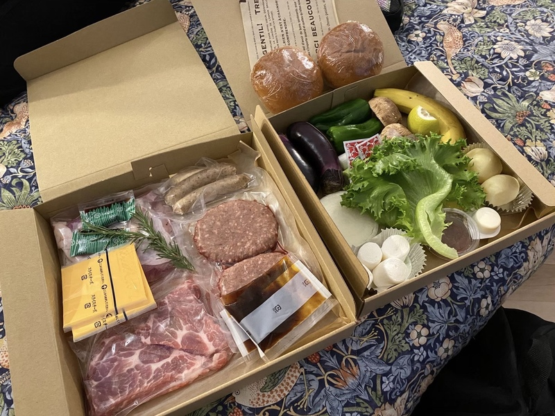{ width=400px }

チェックインするときには既に BBQ コンロと炭がセットされており,
利用者は単に炭を積み木のように重ねて火を起こせばよいだけなので調理開始まで時間がかかることもなく楽でした.
炭火の煙さと匂いはご愛嬌,
グランピングといってもこの辺りはしっかりとしたアウトドアなひとときを体験できますので,
服装やら何やらはそのつもりで準備して向かうことをおすすめします.

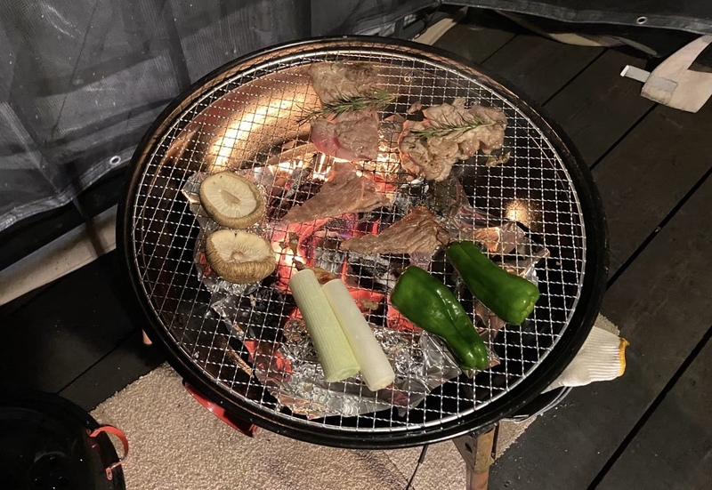{ width=400px }

[予約コース](https://px.a8.net/svt/ejp?a8mat=3T2BM8+DWPKJ6+1OK+BW8O2&a8ejpredirect=https%3A%2F%2Fwww.ikyu.com%2FikCo.ashx%3Fcosid%3Da8ikyu%26surl%3Dhttps%253A%252F%252Fwww.ikyu.com%252F00001932%252F%253Fadc%253D1%2526lc%253D1%2526pln%253D11076156%2526ppc%253D2%2526rc%253D1%2526rm%253D10203645%2526si%253D1%2526st%253D1)の説明にある natural BBQ というものが実際どのようなものなのか,
食材の説明は事前にあったものの具体的なイメージまでは湧いていなかったのですが,
種類はわりと豊富で大人 2 名が両者ともにしっかりと満腹になるボリュームがありました[^4].

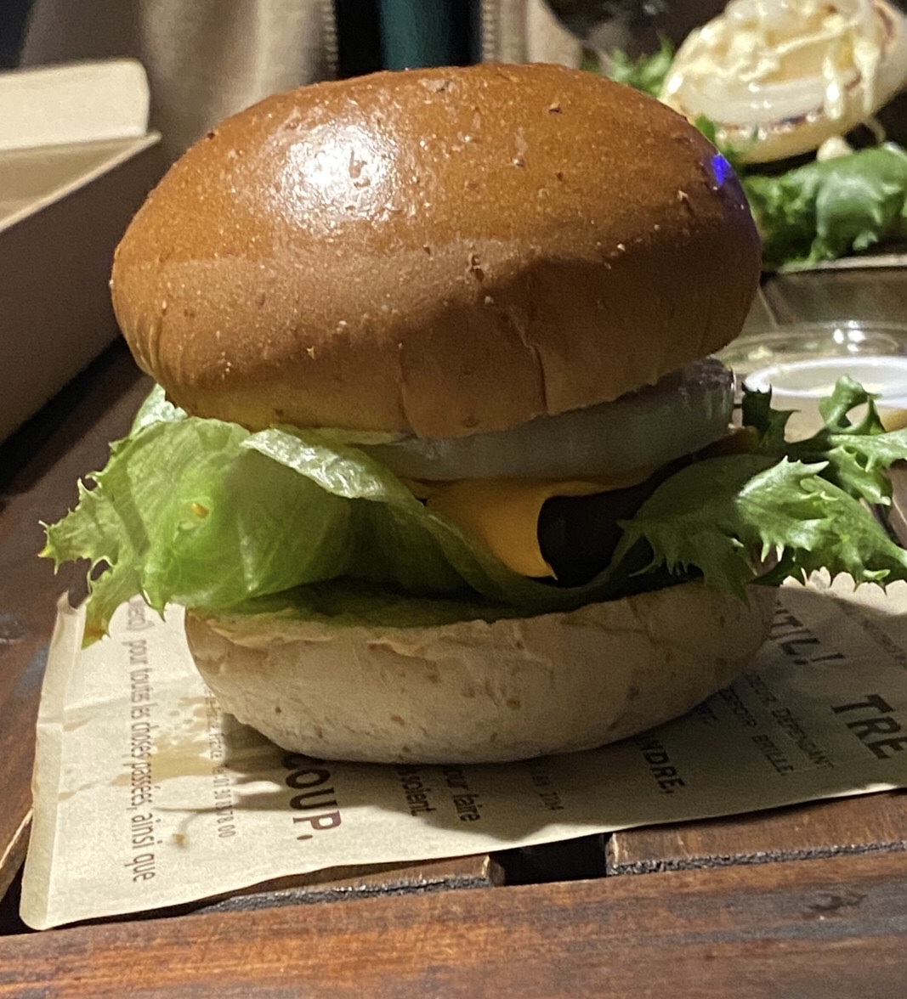{ width=400px }

上図はその natural BBQ に含まれる自作炭火ハンバーガーです.
ブレッド, チーズ, レタス, 分厚いパテ, 玉ねぎそれぞれに火を通して挟み,
BBQ の〆として豪快に食しました:hamburger: 
炭火+シチュエーションが合わさってなのでしょうが,
なぜここまで美味しくなるのかと思うほど美味しかったですね.
BBQ のデザートとして定番のマシュマロもついており,
コーヒーと共に楽しみました.

## 入浴, 就寝

一般的なキャンプでは考えられないですが,
キャメルゴルフ＆ホテルリゾートのグランピングでは入浴ができます.
今回の宿泊プランでは, ロビー塔内部の[大浴場](https://www.camel-golf.com/nocategory/%e5%a4%a7%e6%b5%b4%e5%a0%b4%e3%81%ae%e3%81%94%e6%a1%88%e5%86%85/)を利用できました.

<figure>
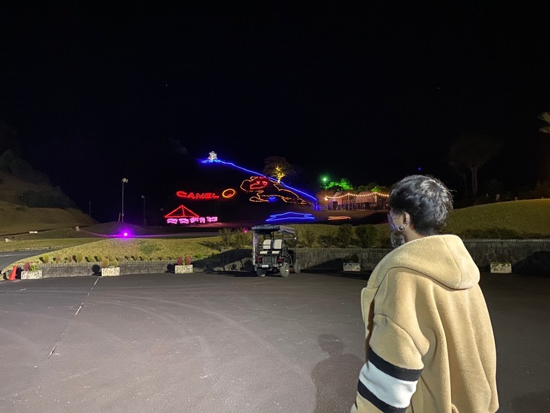
<figcaption>お風呂上がりに見えたライトアップ</figcaption>
</figure>

ゴルフ場なだけあって辺りはかなり開いており,
天体観測にはもってこいの環境で, この日は幸運にも晴天だったこともあり,
流れ星を何回も見ることができました.
なお, 今回のドームテント内部には暖房器具がついてはいるのですが,
それでも就寝時には寒いと感じましたので,
冬に行く際は暖かい寝間着を持参することをおすすめします.

## 朝食

朝食は, 
[同プラン](https://px.a8.net/svt/ejp?a8mat=3T2BM8+DWPKJ6+1OK+BW8O2&a8ejpredirect=https%3A%2F%2Fwww.ikyu.com%2FikCo.ashx%3Fcosid%3Da8ikyu%26surl%3Dhttps%253A%252F%252Fwww.ikyu.com%252F00001932%252F%253Fadc%253D1%2526lc%253D1%2526pln%253D11076156%2526ppc%253D2%2526rc%253D1%2526rm%253D10203645%2526si%253D1%2526st%253D1)だと元々ホテル内でのビュッフェだったようなのですが,
コロナの情勢もあったために, お弁当の配達という形式になっていました.

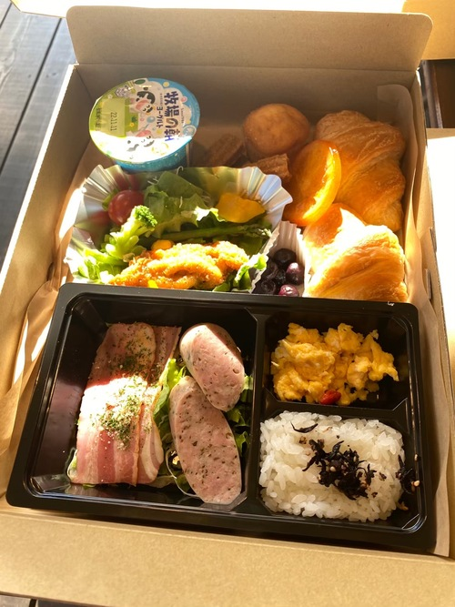{ width=250px }

元々ビュッフェであったことを感じさせるような, 和洋の混ざったバランスのよい朝食でした.
朝も晴天であったことから BBQ スペースを利用したのですが,
自然の中, 暖かな木漏れ日と穏やかなそよ風を感じながら食べる朝食は, なかなか至福なひとときでした.

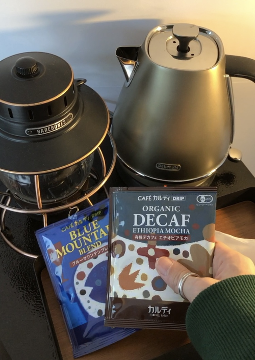{ width=250px }

起床し, ウッドデッキに立ち, 日を浴びながら背伸びと大あくびをし, 空を見上げる.
もうこれだけで, 人間本来/哺乳類としての自然形に立ち返れたような気がして...
キャンプにハマる人々共通の趣を感じることが出来たと思います.

## チェックアウト, 昼食

荷物の整理と片付けを済ませ, ロビー前指定の駐車場までバギーで移動し, チェックアウトを済ませました.
記事冒頭の「バーディくん」との記念撮影は, このチェックアウト時に行ったものです.
そして, 帰りも特急「わかしお」に乗って東京まで戻る予定だったのですが,
乗車までの時間を余らせてあったので, 施設内でお土産を購入したのち,
タクシーに配車を依頼して御宿駅付近のどこかで昼食をとることとしました. 
今回は全国旅行支援を利用していたので, 千葉県の地域クーポン 3,000 円分が 2 枚あり,
これをお土産と昼食代に当てました.

でのランチ. 地域クーポンを利用したため僅か数百円で頂けた](./day2_lunch.jpg){ width=400px }

昼食は上図のとおり[たなか寿司](https://goo.gl/maps/xhckAJCGio16sPnu5)というところで頂きました.
地域クーポンを利用することで, これだけの豪華なお刺身の盛り合わせを僅か数百円で頂くことができ,
お得/満足感がありました. 
食後も特急の乗車まで少し時間が余っていましたので,
ワゴンカーで売られていたコーヒーを 1 杯頂戴し,
オーナーの方と談笑したりすることもでき, 御宿という地域での思い出は,
最後まで筆者にとってとても満足のできるものとなりました.

## 全体を通しての概算費用

全体を通しての費用ですが,
今回は全国旅行支援割を利用することが出来ましたので,
大人 2 名 の 1 泊 2 日のグランピングとしては,
通常よりもかなりお得な金額に収まっていると思います.

| 項目 | 料金 |
| :--: | :--: |
| 割引（チケットレス）特急「わかしお」往復指定席券[^5] | \\(2,440\text{円}\times 2\text{人}=4880\text{円}\\) |
| 往復乗車料 | \\(1,980\text{円}\times 2\text{人}\times 2=7920\text{円}\\) |
| 御宿駅\\(\leftrightarrow\\)キャメルゴルフ＆ホテルリゾート往復タクシー料 | \\(5,800\text{円}\\) |
| 宿泊料 | \\(20,000\text{円}\times 2-1,200\left(\text{一休ポイント即時利用}\right)\text{円}-10,000\left(\text{全国旅行支援}40\%\text{OFF}\right)\text{円}=28,800\text{円}\\) |
| お土産 | 地域クーポン利用, タダ |
| 昼食代 | 地域クーポン利用, ほぼタダ (忘れた...) |

ほか細かな費用はありますが,
大人 2 人全部合わせて**計 47,400 円**というのはなかなか破格なのではないでしょうか.
宿泊費が 2 名で 28,800 円というのがビジネスホテルに泊まっているのかというくらいお得な料金でしたね.
ありがとう全国旅行割！

## 総括

今回筆者は人生初のグランピングだったのですが,
想定していた以上にしっかりとリフレッシュできました.
コロナ禍もあったことから世間も開放感を求めてアウトドアの波がきている気がしますが,
今回の体験をもってそれにも納得という感じでした.
施設の設備やサービスにも不満を感じることはなく,
チェックインからチェックアウトまで快適に過ごさせて頂けたと思います. 
実際に体験してみて, 忖度なしにおすすめできる 1 泊 2 日でしたので,
みなさまもよろしければ遊びに行ってみてください.

<article class="mb-3 mt-3 message is-info">

<i class="fas fa-info-circle"></i> :point_right:
<a href="https://px.a8.net/svt/ejp?a8mat=3T2BM8+DWPKJ6+1OK+BW8O2&a8ejpredirect=https%3A%2F%2Fwww.ikyu.com%2FikCo.ashx%3Fcosid%3Da8ikyu%26surl%3Dhttps%253A%252F%252Fwww.ikyu.com%252F00001932%252F%253Fadc%253D1%2526lc%253D1%2526pln%253D11076156%2526ppc%253D2%2526rc%253D1%2526rm%253D10203645%2526si%253D1%2526st%253D1" rel="nofollow">ドームテント (グランピング) -2食付- お夕食は natural BBQ！ 移動用バギーカート付き | キャメルゴルフ＆ホテルリゾート </a>

</article>

...私はもし次にも行ければ,
必ずフットゴルフを体験したいところです:soccer:

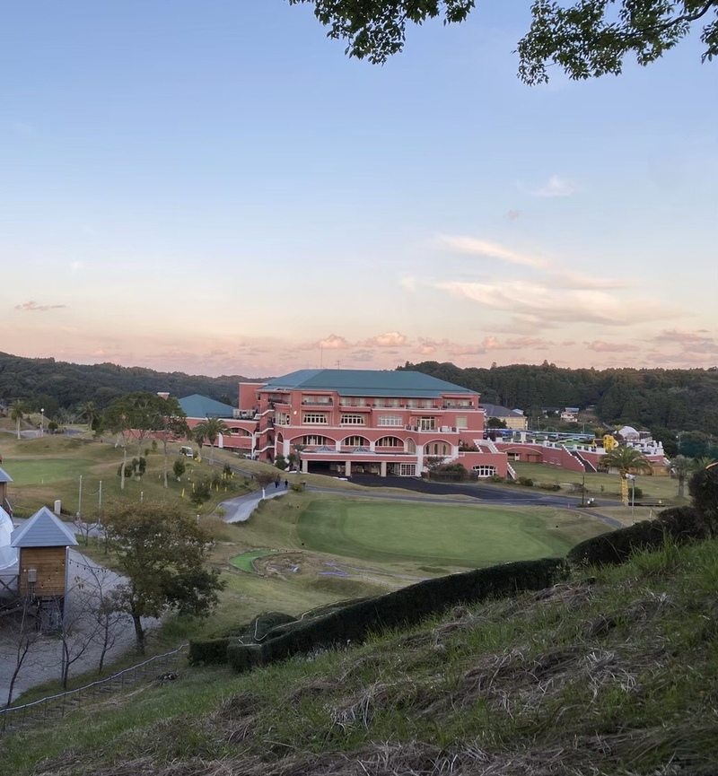{ width=400px }

[^1]: 東京方面からの場合は, アクアライン $\rightarrow$ 圏央道 $\rightarrow$ 市原鶴舞 IC 下車 $\rightarrow$ 国道 297 線経由で約 35 分とのこと :point_right: <https://www.camel-golf.com/access/>
[^2]: 運転手は普通自動車免許などの所持者である必要があります
[^3]: 出典: 読売新聞文化部 (2013) 『唱歌・童謡ものがたり』岩波書店〈岩波現代文庫〉, pp193-195, ISBN: 978-4-00-602227-3
[^4]: 筆者もその連れもものすごく大食いというわけではないので, 大食いの方や食べ盛りの方からするともしかすると足りないかもしれないですが, 1 つ 1 つの食材が大きいので満足感はあると思います
[^5]: 「[えきねっと](https://www.eki-net.com/Personal/Top/Index)」からの当時購入金額
