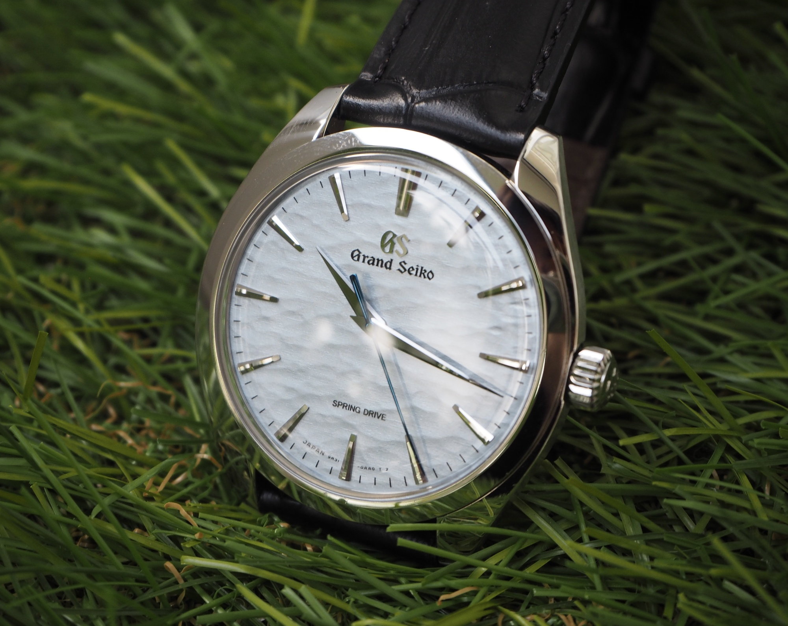
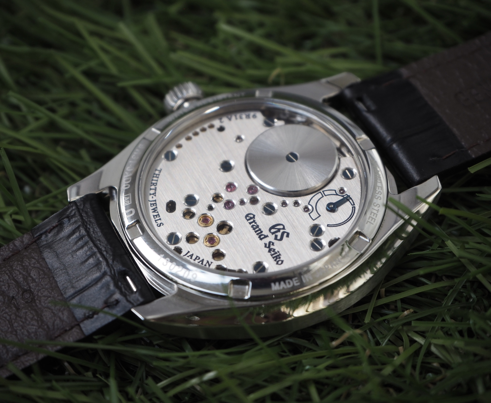
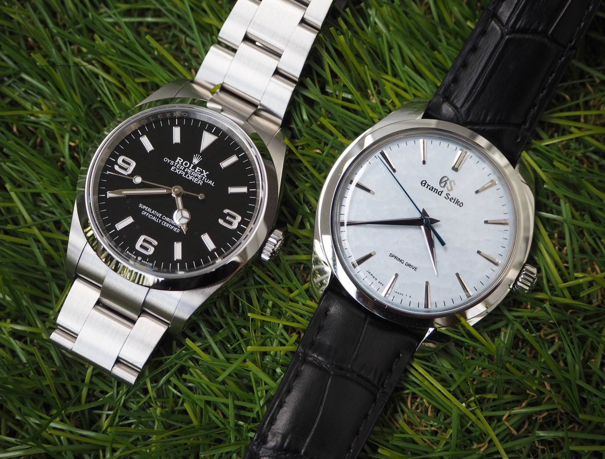
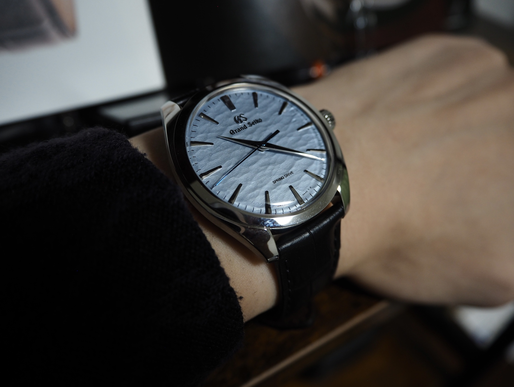
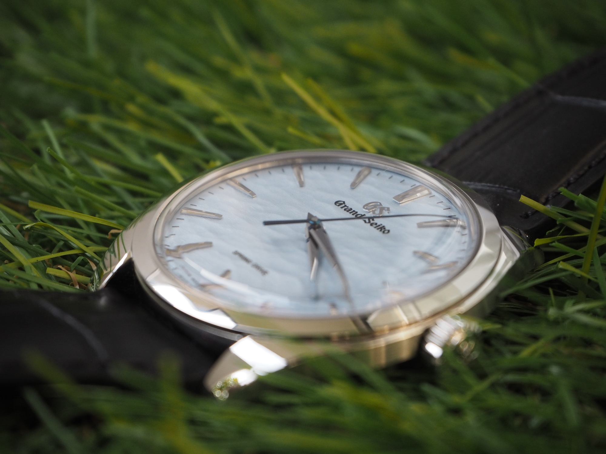
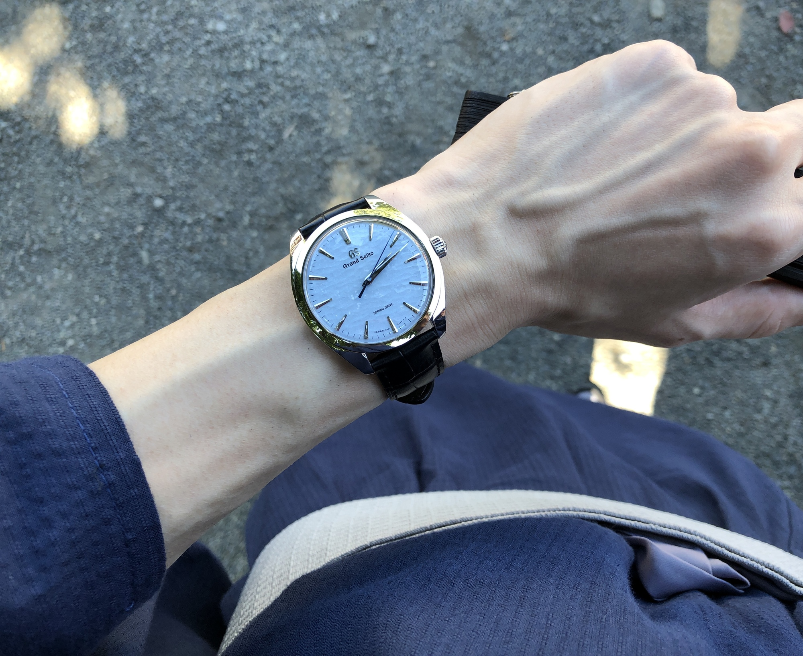

神は細部に宿る――そんな言葉の似合う日本のドレスウォッチがあります.

](./sbgy007_wrist.jpg){ width=500px }

この度 Grand Seiko (以下 GS)
Elegance Collection SBGY007
を手にしましたので,
実際に使用しての所感等を紹介したいと思います.

<!--more-->

## GS Elegance Collection とは

GS には[数多くのコレクション](https://www.grand-seiko.com/jp-ja/collections)がありますが,
本記事で紹介する SBGY007 は
GS のエレガンスコレクションというグループに属するタイムピースです.

> 優れた実用性を備えながら、人生の中の特別なシーンで装いのアクセントとなり、美しさを演出するモデルを展開するエレガンスコレクション。どのような場所や時間帯であっても、その腕時計は、どこからでも美しく光を受けて、繊細な煌めきをまといながら、腕時計をつける人に自信と余裕を与えてくれます。エレガンスは永遠。グランドセイコーが尊ぶ日本の美意識と洗練されたデザインを融合することによって、そのことを表現するコレクションです。-- *GS 公式サイト*

俗に言うドレスウォッチや初代 GS 復刻モデル,
クラシックモダンなモデルらが属するコレクションであり,
以前紹介の [SBGA439](roki.diary/2022/09/20/gs-sbga439-review) 
が属する虚飾を排して最もバランスの取れた王道デザインを特徴とするヘリテージコレクションとはまた異なったコレクションですね.

## コンセプト

SBGY007 搭載のムーブメント 9R31
は長野県にある[信州 時の匠工房](https://www.grand-seiko.com/jp-ja/worldofgrandseiko/manufacture/shinshuwatchstudio)で作られていますが,
SBGY007 は,
そこにほど近い諏訪湖で起きる神秘的な自然現象「<ruby>御<rt>お</rt>神<rt>み</rt>渡<rt>わた</rt></ruby>り」をイメージしたダイヤルのモデルです.

より引用](./omiwata.jpg){ width=400px }

御神渡りとは, 諏訪湖の湖面が全面氷結した際に気温の上下によって膨張と収縮が繰り返された氷に亀裂が入り,
氷が筋状に山脈のように高さ 30cm から 1m80cm 位に盛り上がる現象のことで,
諏訪神社上社の建御名方命（男神）が下社の八坂刀売命（女神）のもとへ通った道筋といわれています[^1]. 
本モデルは後述するディテールやスペックの他に,
古事記等に伝わる日本神話の神に因んでいるという意味でも,
冒頭で申し上げましたとおり*神が細部に宿った*モデルといえましょう.

## スペック

基本的なスペックは
[GS 公式サイト](https://www.grand-seiko.com/jp-ja/collections/sbgy007)記載の通りです.

{ width=400px }

横 38.5mm, 縦 43.7mm, 厚さ 10.2mm のステンレススティールケースとなっており,
風防は内面無反射コーティングのされたサファイアガラス,
ラグからラグ (バンド幅) の長さは 19mm (!) となっています.
やはり目を引くのがこの独特な模様の文字盤で, 凍てついた諏訪湖の質感が表現されていますね.
鋭い秒針は青焼きで, 背景のアイスブルー色との絶妙なバランスが伺えます.

{ width=400px }

裏蓋はサファイアガラスによるシースルーバック仕様になっており,
9R31 ムーブメントを鑑賞することができるほか,
パワーリザーブインジケーターがこちら側についているので,
ぜんまいの巻き上げ時などで確認することができます.
防水性能は日常生活用防水 (なので 3 気圧くらい？),
耐磁性能はありとなっています (が当コレクションのコンセプト的にこれはあまり期待しすぎてはならない).

{ width=400px }

ムーブメントはキャリバー [9R31](https://www.grand-seiko.com/jp-ja/collections/movement/springdrive/9r31)
手巻きスプリングドライブ[^2] (以下 SD) であり,
ひとつの香箱のなかに 2
つの動力ぜんまいを用いたデュアル・スプリング・バレル機構によって 72
時間のパワーリザーブを実現しているとのこと.
また, 精度は日差 $\pm 1$ 秒相当となっています.

## 所感

ここからは筆者個人の所感です.
それぞれ良いと思ったところとそうでないところとでご紹介します
(あくまで主観的感想ですので悪しからず).

### :+1:サイズ感

まず良い点として挙げたいのは, 横 38.5mm 縦 43.7mm 厚さ 10.2mm という薄くて小さなサイズ感です.
これは現代のドレスウォッチのサイズとしてとても良いバランスだと思いますし,
筆者の超細腕 (手首周り 14cm) にとってもありがたいサイズ感です.

### :+1:精度とパワーリザーブ

これはさすがというところですが,
日差 \\(\pm 1\\) 秒という精度の高さは本物で,
筆者が使い続けた感じでは日差 \\(\pm 1\\) 秒どころか
1 週間で \\(\pm 1\\) 秒のズレがあるかないかくらいの体感でした.

{ width=400 }

ハック機能により秒針をしっかりと合わせることができるうえにこの精度,
また 72h パワーリザーブなのでフルに巻き上げれば 3 日に 1 回だけで良い...
ドレスウォッチながら頼りになる,
エレガンスコレクションのコンセプト「優れた実用性を備えながら」を正に体現した*使える*一本であると感じました.

### :+1:美しい外装仕上げ, ダイアル, インデックス, ムーブメント

GS といえば SD, ハイビート,
ザラツ研磨だなあと筆者は思い浮かべるわけですが,
本作品においてもその歪みのない鏡面仕上げとサテン仕上げの組み合わせにより,
美しい外装が実現されています.
ダイアルには, 職人たちによって手作業で作られた金型を用いて型打ちし,
氷の模様を表現しているとのことで非常に手が込んでおり,
自然で有機的な質感が感じられる仕上がりとなっています.
ここまで本モデルについての写真を複数枚掲載していますがそれらの映り具合を見比べるとお分かり頂けるように,
光の当たり方やダイアルを見る角度が変わることによって質感や色味が違うように感じとれるかと思います.
実際の氷もそうであるという点で非常に再現度/表現度が高く,
様々な表情変化を楽しむことができるという点で満足度は高いです.

{ width=400px }

バーインデックスもきらびやかで, GS の研磨技術の凄さを感じられます.
同じ Elegance Collection のアイスブルーダイヤルとして似た外観のモデル
[SBGW283](https://www.grand-seiko.com/jp-ja/collections/sbgw283)
がありますが, それと比較すると, SBGW283 がバケット型のインデックスであるのに対して,
本モデルではその先端が鋭利なものとなっています.
これによりインデックスに反射した光が SBGW283 よりも鋭い印象を感じました.
分針と秒針を近くでよく見ると,
先端が文字盤側に曲げられておりダイアルのギリギリまで針が届くようなっていて,
これが視認性の向上に繋がっているのでははないかと思います.

{ width=400px }

厚みのある長針と短針は磨き上げも相まって立体感が感じられ,
これだけ重そうな針を回すのはトルクが強力であることの証明でもあり,
機能, デザインの両面においてもその優秀さが伺えます.
青焼きの針もとても美しく,
SD ムーブメントによるスイープ運針と相まってまるで氷の上を滑っているかのように感じられ,
これがまた美しく, 見とれてしまうものがあります.

{ width=400px }

パワーリザーブ表示を後ろに見せダイヤル側に載せなかったことでシンメトリーデザインが実現されており,
これがダイアルのテクスチャを存分に楽しませてくれます.
また,
上図の通りトランスパレントケースバックによってヘアライン仕上げの美しいムーブメントが鑑賞できるようになっているのは素晴らしいですし,
手巻き SD というもの自体ロマンの詰まった機構なので,
それだけでも所有欲が満たされますね.

### :+1:和装に合う

たまたま和装 (というか実際はもっとカジュアルな浴衣) を着る機会と重なり,
本モデルと組み合わせてコーディネートしてみたのですが,
これがまた相性抜群でした.

{ width=400px }

ケース厚が薄いので, 和服の袖に引っかからないところも良いですし,
浴衣というカジュアルな装いを自然にランクアップさせてくれる印象で,
筆者としては SBGY007 に限らず和装に合わせる腕時計としては GS Elegance Collection 
の手巻きモデルをぜひ推したいですね.
日本ブランドなので和服に合うのは当然, と考えることもできなくもないのかもしれないですが,
日本の感性をしっかりと落とし込み,
高い完成度で 1 つのプロダクトとしてまとめる力があるからこそだと筆者は感じますし,
この相性の良さは唯一無二と言っても過言ではないと思います.

### :-1:防水性能, 耐磁性能

公式には「日常生活用防水」, また「耐磁:あり」とだけ記載されており,
実際のところどれくらい耐えられるのかは分かりません.
まあこれはドレスウォッチなら仕方がないといってしまえばそうなのですが,
できれば具体的な値を知りたいというところがユーザー側の本音としてはあると思います.

### :-1:ラグ幅のサイズが奇数

ラグ幅が 19.2 mm という奇数サイズであるため,
必然的に代替ストラップの選択肢が少ないです.
まあ, 元のクロコダイルストラップ,
ブルーのステッチは素晴らしい風合いなので替えることは考えない！というとそれまでなのですが,
いずれにせよ代替手段が多いに越したことはないのでこの奇数サイズという点に関しては少しネガティブなポイントになってしまうのかなと思いました.

### :-1:細腕にとってのバックル位置

ストラップの一番端の穴に差し込むくらい細い腕だと, 中留具が腕の側面にきてしまうため,
着用感が悪くなります.
また, フォールディングバックルに厚みがあるため,
デスクワークの際に少々煩わしく感じることがあるかもしれません.

### :-1:ローター以外があまり見えない

シースルーバックに求めるものは人それぞれかと思いますが,
筆者としてはもう少しその輪列や歯車の動きが見えるようになっているとなお良いのだろうなと感じました.
輪列のほとんどを覆っているその受けは, ヘアラインや面取りの仕上げ,
彩りのあるネジやロゴなど非常に手が込んでおり美しいのですが,
ローターだけでなく他の部品についてもより詳しく鑑賞したいと思う方は一定数おられるのではないかと思います.

### :-1:竜頭の不具合？

この現象は実機で確認することはできませんでしたが,
竜頭操作の上で特に意味をなさない謎の段階があるという[動画](https://youtu.be/TbAa0CAzwHM)がありました🤔
これは本来の仕様ではないと思うのですが, 実際にご購入される際は手にとって確認することをおすすめします.

## 総括

SBGY007 は, 一見遠目から見ると普通のドレスウォッチという感じであるものの,
よりフォーカスを当ててみれば手巻きの SD, ザラツ研磨, 手の込んだ型押しなど,
*GS らしさ*の詰まった実用的なドレスウォッチであり,
**確固たる意思をもって所有する特別な 1 本**なのではないかと思いました.

> 選ぶという行為には、サイコロでも振らない限り当事者の意思が込められる。数あるモデルの中から1本を選び抜くために、その外観に惚れ、ストーリーに共感するという過程を通じてこそ、満足のいく結果に到達できるのではないだろうか。(snip)
> 
> 流行や知名度に任せて時計を選ぶのは簡単だ。しかしグランドセイコーは、そんな安易な考えを許さず、もっと自分に向き合えと語りかけてくる。-- *参考文献 5*

GS のフィロソフィー "THE NATURE OF TIME" を具現化した,
古来より持つ日本人の感性を想起させるこのタイムピースは,
まさに日本の美の象徴の 1 つなのかもしれないですね.

## 参考文献

1. 『Grand Seiko Elegance Collection SBGY007』, <https://www.grand-seiko.com/jp-ja/collections/sbgy007>
1. 滝沢隆史 (2023)『諏訪湖の御神渡り、5年連続で今季も「不出現」を宣言』, <https://www.asahi.com/articles/ASR247GJWR24UOOB006.html>
1. 『諏訪湖の御神渡り』, <https://shinshu.fun/event/omiwata>
1. 紺野うみ (2023)『御神渡り』, <https://www.543life.com/koyomi/post20230131.html>
1. 野島 翼 (2022) 『諏訪の御神渡りをダイアルに落とし込んだ、グランドセイコー「SBGY007」をレビュー』, <https://www.webchronos.net/features/79334>

[^1]: 近年は温暖化の影響が指摘されており, 2019 年から当記事執筆時の 2023 年時点では 5 年連続で不出現となっている. c.f. 参考文献 2
[^2]: スプリングドライブに関しての詳細は[公式サイト](https://www.grand-seiko.com/instructions/html/GS_9R_ja/GOUMSYrjpbinhk)をご覧ください.
