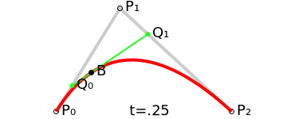
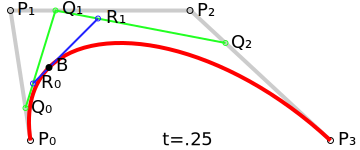
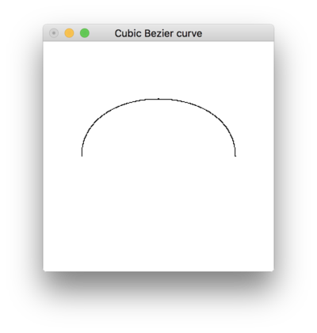

典型的なパラメトリック曲線の一種である, ベジェ曲線(Bézier curve)についての学習メモ. パラメトリック曲線とその一種であるエルミート曲線に関しては, [前回の記事](/roki.log/2018/04/15/hermite-curve/)を参照.

ベジェ曲線は, パラメータ \\(t\\ (0 \leq t \leq 1)\\) 
と複数の制御点 $P_i$ から構成されるパラメトリック曲線の一種である[^1].
始点と終点の線分から成る, 次数 $n$ のベジェ曲線は $n+1$ の制御点をもち
($= P_0, P_1, \cdots, P_n$ の制御点があるベジェ曲線を $n-1$ 次ベジェ曲線という),
この内分点を繰り返し取ることによって, 曲線を得ることができる. 
この始点と終点の線分を, セグメントといい, これが得られる曲線そのものになる[^2]. 
まず, ここでは 2 次ベジェ曲線を描くとして, そのイメージをつけるために, 図[^3]を用いてその概要を見る.
なお, 2 次ベジェ曲線は true type フォントなどで使われている.



<!--more-->

図で示されている各変数について取り上げる.
上図 $P_0, P_1, P_2$ は平面 $\mathbb{R}^2$ 上に取った 3 点である.
$t$ は $0 \leq t \leq 1, t \in \mathbb{R}$ であり, $P_0$ から $P_1$, また $P_1$ から $P_2$ の間で $0$ から $1$ に増加する. 
このとき, $t$ に対して変化する $P_0$ と $P_1$ の線分上の一点を $Q_0$, $P_1$ と $P_2$ の線分上の一点を $Q_1$ とする.
上図では, $t=0.25$ であるから $Q_0$ は $P_0$ と $P_1$ の線分上の $\displaystyle\dfrac{1}{4}$ の地点にあることがいえる.
このとき $Q_1$ は, <u>$P_2$ から見て</u> $P_1$ と $P_2$ の線分上の $\displaystyle\dfrac{3}{4}$ の地点にあることがいえる.
これは, $Q_0 : Q_1 = t : 1 - t$ という対比で表すことができる(つまり, $Q_0 = (1-t)P_0 + tP_1, Q_1 = (1-t)P_1 + tP_2$).
そして, $Q_0$ と $Q_1$ の線分上を $t : 1-t$ の比率となる 1 点をとり, これを $B$ とする(つまり, $B=(1-t)Q_0+tQ_1$).
これが, 2 次ベジェ曲線の 1 点となるのである. $t$ の増加によって, $t : 1-t$ の比率が変化していくから, それを繰り返し取ることで放物線(曲線)が得られるのである.[^4]<br>
$Q_0, Q_1$ を $B$ に代入すると, $B$ は次の 2 次式となる.

<div class="m-def">
<header class="m-def-title"><p><span id="2dim-bezier">\\(2\\) 次ベジェ曲線</span></p></header>
<div class="m-def-content">
\\[B = (1-t)^2 P_0 + 2t(1-t)P_1+t^2 P_2\\]
</div>
</div>

$P_0, P_1, P_2$ の各係数に着目すると, 結果的に 2 次バーンスタイン基底関数が得られたことがわかる[^5].
以下に, 2 次ベジェ曲線を描画していく様子を示す[^6]. 
「動かす」をクリックすると, 二次ベジェ曲線を描くアニメーションが描画される.
各制御点をドラッグして操作できる. やめるをクリックすると, 描画を隠す.

<div class="box has-text-centered is-shadowless">
<div style="text-align: center;">
<input 
    id="bezierButton" 
    class="button is-link is-light" 
    type="button" 
    value="動かす" onclick="drawBezier()" />
</div>
<div id="vis"></div>
</div>

この放物線の構成法を一般化したものが, ド・カステリョのアルゴリズムである.

<div class="m-def">
<header class="m-def-title"><p><span id="deCasteljaus-algorithm">ド・カステリョのアルゴリズム</span></p></header>
<div class="m-def-content">
平面 \\(\mathbb{R}^2\\) の \\(n+1\\) 個の点 \\(P_0, P_1, \cdots, P_n\\) と実数 \\(t\in\mathbb{R}\\) に対し 
\\(\displaystyle P^0_i(t) = P_i\\) としたとき,\\[
P^r_i(t) = (1-t)P^{r-1}_i(t)+ tP^{r-1}_{i+1}(t), (r=1, \cdots, n; i = 0, 1, \cdots, n - r)
\\]
</div>
</div>

ここで, 特にこれを再度書く意味は全くないが, 
[前回の記事](/roki.log/2018/04/15/hermite-curve/)では曲線描画に関して 
Haskell で書いたので, こちらもなんとなく載せて置く.

```Haskell
-- | A function that generates a coordinate list of quadratic Bezier curves according to 
--
-- the three control points, them density and the range of @t@ (@bt <= t <= et@).
quadraticBezier :: (Float', Float') -> (Float', Float') -> (Float', Float') -> Float' -> Int -> Int -> [(Float, Float)]
quadraticBezier p0 p1 p2 = ((map (bx &&& by).).).linspaceWithDensity
    where
        b20 t = (1 - t)^2
        b21 t = 2 * (1 - t) * t
        b22 t = t^2
        bezier t v1 v2 v3 = b20 t * v1 + b21 t * v2 + b22 t * v3
        bx t = bezier t (fst p0) (fst p1) (fst p2)
        by t = bezier t (snd p0) (snd p1) (snd p2)
```
`quadraticBezier (-1.0, -1.66) (1.10, -1.88) (0.04, 0.86) 0.001 0 1` とし,
[前回の記事](/roki.log/2018/04/15/hermite-curve/)のように GLUT を使って出力すると, 次のような曲線が得られる.

{ width=400px }

また, 3 次ベジェ曲線は, 冒頭で述べた通り, 次数 $n$ に対して $+1$ した制御点を持つので, $4$ つの制御点を持つ[^3].



考え方は 2 次ベジェ曲線のときと同様で, 最終的に 3 次ベジェ曲線における $B$ は次の 3 次式となる.

<div class="m-def">
<header class="m-def-title"><p><span id="3dim-bezier">\\(3\\) 次ベジェ曲線</span></p></header>
<div class="m-def-content">
\\[B = (1-t)^3 P_0 + 3(1-t)^2 P_1 + 3(1-t)t^2 P_2 + t^3 P_3 \\]
</div>
</div>

3 次ベジェ曲線は, アドビ社のポストスクリプトフォントや画像編集ソフトなどで使用されている.

```Haskell
-- | A function that generates a coordinate list of cubic bezier curves according to 
--
-- the four control points, them density and the range of @t@ (@bt <= t <= et@).
cubicBezier :: (Float', Float') -> (Float', Float') -> (Float', Float') -> (Float', Float') -> Float' -> Int -> Int -> [(Float', Float')]
cubicBezier p0 p1 p2 p3 = ((map (bx &&& by).).).linspaceWithDensity
    where
        b30 t = (1 - t)^3
        b31 t = 3 * (1 - t)^2 * t
        b32 t = 3 * (1 - t) * t^2
        b33 t = t^3
        bezier t v1 v2 v3 v4 = b30 t * v1 + b31 t * v2 + b32 t * v3 + b33 t * v4
        bx t = bezier t (fst p0) (fst p1) (fst p2) (fst p3)
        by t = bezier t (snd p0) (snd p1) (snd p2) (snd p3)
```
同様に`cubicBezier (1, 0) (1, 1) (-1, 1) (-1, 0) 0.001 0 1`とすると, 次のような曲線が得られる.

{ width=400px }

[^1]: ベジェ曲線はフランスの自動車メーカーシトロエン社のド・カステリョ (de Casteljau) とルノー社のベジェ (Bézier) によって独立に考案されたものの, 企業秘密として 1960 年代の後半になるまで公表されなかった. ド・カステリョによる研究はベジェよりも先んじていたが, その論文が公知とならなかったために, これらの理論にはベジェの名前がついているとのこと. 参照: 鳥谷 浩志; 千代倉 弘明 (1991). 3次元CADの基礎と応用. 共立出版. ISBN 9784320025394.
[^2]: 用語に関する参照: [曲線・図形の書き方(ベジェ曲線)](http://tomari.org/main/java/kyokusen/bezier.html)
[^3]: 図は Wikipedia Commmons (パブリックドメイン) から.
[^4]: 参考: ド・カステリョのアルゴリズム.
[^5]: 2 次バーンスタイン基底関数によるベジェ曲線は, 一様 2 次 B スプライン曲線と全く同じ. ここでいう「一様」とは, パラメータ $t(\{t_0, t_1, t_2, \cdots\})$ を等間隔にとることをいう.
[^6]: このアニメーションは, d3.js を使って[実装した](https://github.com/falgon/roki.log/blob/gh-pages/js/quadraticBezier.js).
