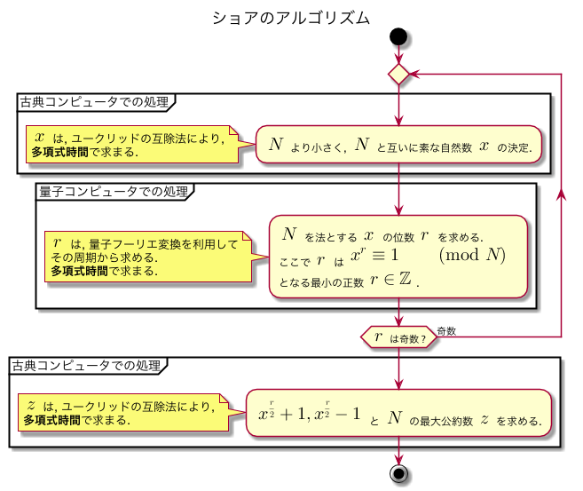

お題自由な学校のレポート課題[^1]内で, ショアのアルゴリズムを説明するために
QFT の概要について示したのだが, 折角なのでその内容の一部を抜粋し, 
こちらのブログのほうにも載せておくことにした.
ショアのアルゴリズムについては, 調べればいくらでも出てくるし, 学会誌, 
書籍等で分かり易く述べられていることも多いので,
本エントリで特別取り上げることはしないが, その大体は以下のアクティビティ図の手順の通りである[^2].

{ width=450 }

<!--more-->

<i>なお, 私自身は量子力学, 量子コンピュータ分野における専門家ではないため, 注意してください.
間違った箇所, 不自然な箇所等ございましたら, ご報告いただけると幸いです.</i>

まず, DFT を次のようにおく[^3].
\\[\displaystyle F(t) = \sum_{x = 0}^{n-1} f(x)\exp(-j\dfrac{2\pi tx}{n}\tag{1})\\] ここで, $f(x)$ は入力の関数, $j$ は虚数単位である. QFT は, 正規化係数を $\dfrac{1}{\sqrt{n}}$ とした有限次元内積空間内における正規直交基底 $|0\rangle, \cdots, |n-1\rangle$ 上の状態,
\\(\displaystyle \sum_{x=0}^{n-1} f(x)|x\rangle\\)
の各係数となる複素関数の値を離散フーリエ変換したものであるといえる. 
すなわち, 式 $$ の定義をふまえて, 
\\[\displaystyle \sum_{x = 0}^{n-1} f(x)|x\rangle \mapsto \sum_{i = 0}^{n-1}F(i) |i\rangle\\] または, 
\\[\displaystyle |x\rangle \mapsto \dfrac{1}{\sqrt{n}}\sum_{k=0}^{n-1}\exp(-j\dfrac{2\pi xk}{n}) |k\rangle\\]
と表すことができ, いま \\(m\\) Qubit があるならば, 扱えるデータ数は \\(2^m\\) となるため 
\\[\displaystyle |x\rangle \mapsto \dfrac{1}{\sqrt{2^m}}\sum_{k=0}^{2^m-1}\exp(-j\dfrac{2\pi xk}{2^m}) |k\rangle\\]
と表せる. これを量子回路として実装していく. 結論から言うと, この量子回路は, アダマールゲートと, 
制御ビットが $1$ のときのみ, 信号量子ビットの位相を $\exp(\dfrac{j2\pi}{2^{k+1}})$ だけシフトする
制御位相シフトゲートを利用することで実現できる. 
次に, 2 Qubit を用いた QFT の量子回路図を示す[^4].

{ width=300 }

ここで \\(|q_1\rangle\\) は 
\\[|0\rangle + \exp(j\pi q_{1})|1\rangle \to |0\rangle + 
\exp(\dfrac{j\pi}{2}(2q_1+q_0))|1\rangle \tag{2}\\] と変化し, 
\\(|q_0\rangle\\) は \\[|0\rangle + \exp(j\pi q_{0})|1\rangle \tag{3}\\] と変化することがいえる. 
いま, 式 $(2)$ の結果を \\(|a_0\rangle\\), 
式 $(3)$ の結果を \\(|a_1\rangle\\) としたとき 
$$|a_1\rangle |a_0\rangle = \left\{|0\rangle + \exp(j\pi q_0)|1\rangle\right\}\left\{|0\rangle + \exp(j\pi q_1 + \dfrac{j\pi q_0}{2})|1\rangle\right\}\tag{4}$$ がいえる. 
ここで, $q$ および $a$ の値の $2$ 進表記をそれぞれ \\([q_1, q_0],\ [a_1, a_0]\\) とすると, 
\\(q = 2q_1 + q_0,\ a = 2a_1+a_0\\) であるので式 $(4)$ は,

$$|a\rangle = |0\rangle + \exp(\dfrac{j\pi}{2}q)|1\rangle + 
\exp(\dfrac{j\pi}{2}q\times 2)|2\rangle + \exp(\dfrac{j\pi}{2}q\times 3)|3\rangle $$ 
と展開できる. 
$|a\rangle$ の各状態の係数が $|q\rangle$ の各状態の係数のフーリエ変換になっていることがわかる.

[^1]: 内容の全コンテンツを[リポジトリ](https://bitbucket.org/r0ki/52520001/src)にまとめているのでもし良ければ.
[^2]: 図は plantuml で生成: [コード](https://bitbucket.org/r0ki/52520001/src/master/plantuml-images/report.uml). この画像もレポート用に生成したものだが, 折角なのでこちらにも貼っておくことにした.
[^3]: 単純にコードに落とし込むだけであるので大したことはないのだが, レポート内で説明するために Haskell で DFT と IDFT を[実装してある](https://bitbucket.org/r0ki/52520001/src/7b42d2be8cfd5c2e5931c553552f9bc9f5e1696f/src/src/Lib52520001.hs#lines-31:48)ので, 一例としてもし良ければ. 一応[テスト済み](https://bitbucket.org/r0ki/52520001/src/7b42d2be8cfd5c2e5931c553552f9bc9f5e1696f/src/test/Spec.hs).
[^4]: 図は qasm2circ で生成: [コード](https://bitbucket.org/r0ki/52520001/src/master/assets/qcircuit/2qubitQtf.qasm).
