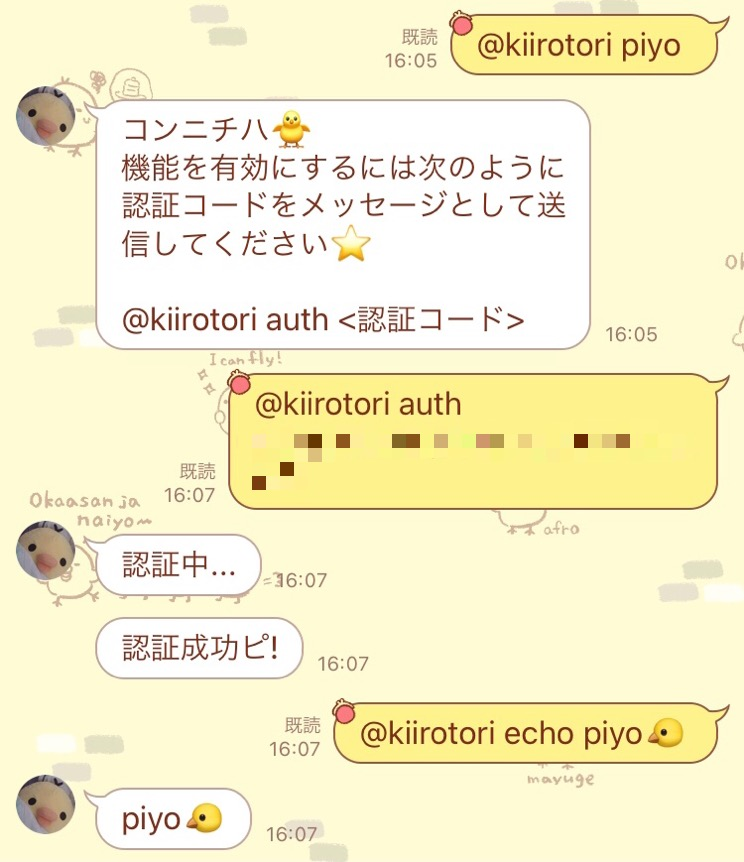

普段業務外では
LINE 株式会社 (以下 LINE 社) が提供する LINE というメッセンジャーアプリ上でやり取りをすることが多いので,
そのインタフェース上で色々と動かせたりするとそれなりに便利かもと最近思い始めた.
そこで,
筆者の考える基本的な機能を備えた LINE Bot を一旦作ってみることとした.
本エントリはその備忘録である.
下記のリポジトリに成果物を公開している.

<div class="has-text-centered mt-2 mb-2">
<i class="fab fa-github fa-fw"></i>
<a href="https://github.com/falgon/line-bot-kiirotori">falgon/line-bot-kiirotori - My LINE Bot
</a>
</div>

## 基本構成

今回は個人利用/小規模であり特別な費用を発生させたくなかったので,
[Oracle Cloud Infrastructure](https://www.oracle.com/cloud/) (以下 OCI)
の Always Free 枠である Ubuntu インスタンス上にサーバを構成した[^7].
同インスタンス上では Jitsi Meet[^1] という別のウェブサービスを nginx
を用いて運用していたので, それをそのままリバースプロキシとしても利用し,
Bot サーバへの通信を HTTPS 化した.
これらはサブドメインに従ってリクエストを振り分けているが,
それぞれの SSL 証明書を作成するのは手間がかかるので, 今回は (let's encrypt の)
ワイルドカード証明書で管理することとした.
ドメイン管理には Google Domains を使っているが,
TXT レコードを随時更新する API が用意されておらず,
現状手動更新が必須となっている.
これは追々なんとかしたい[^2].

<!--more-->

## LINE Bot の実装

LINE Bot を実装するにあたって,
特徴的ないくつかのトピックについて取り上げる.

```bash
$ line-bot-kiirotori --help
Usage: line-bot-kiirotori [--version] [-c|--config <config file path>] 
                          [-s|--cron-schedule <cron-schedule file path>] 
                          [-q|--quiet] COMMAND
  line-bot-kiirotori

Available options:
  -h,--help                Show this help text
  --version                Prints the line-bot-kiirotori suite version
  -q,--quiet               Quiet log output

Available commands:
  serve                    boot server
$ line-bot-kiirotori --version
　　　　 Ｖ
　　 ／￣￣￣＼　/|
　　 　●＿＿●  Ｖ |     __   _ _            __             _
　 ｜　 (･＿･)　 ノ    / /__(_|_)________  / /_____  _____(_)
　 /　　 ヽノ　 ｜    / //_/ / / ___/ __ \/ __/ __ \/ ___/ /
　(_ノ　　　　　ﾉ    / ,< / / / /  / /_/ / /_/ /_/ / /  / /
　　＼＿＿＿＿／    /_/|_/_/_/_/   \____/\__/\____/_/  /_/
　　　 ｜　｜
　　　 个　个


version: 0.1.0.0
built commit hash: 6efc35754150917de47bdf5ef3a56e4d81322098
```

### チャネルアクセストークン v2.1 の発行と管理

LINE Bot を作成するのには LINE 社の提供する
[Messaging API](https://developers.line.biz/ja/docs/messaging-api/)
を利用する.
LINE Messaging API を利用したボットは,
LINE プラットフォームから送信される Webhook
イベントに対して LINE プラットフォームへ応答する必要がある.

 から引用](./messaging-api-architecture.f40bffbb.png)

この LINE プラットフォーム間のやりとりでは,
通信している相手がサービスの利用権限を持つ本人であることを証明するために,
LINE 社の提供する[チャネルアクセストークン](https://developers.line.biz/ja/docs/messaging-api/channel-access-tokens/#what-are-channel-access-tokens)を用いた認証プロセスを経る.
チャネルアクセストークンには, 任意の有効期限が指定できるチャネルアクセストークン v2.1,
短期のチャネルアクセストークン, 長期のチャネルアクセストークンという 3 つの種類がある.
これらの中でも LINE 社はチャネルアクセストークン v2.1 を推奨しており,
その特徴として発行に JSON Web Token (以下 JWT) 使用し, 期限を任意 (最大 30 日) に指定できる点が挙げられる.
今回は個人利用ではあるものの,
期限を<i>良い感じ</i>に短くしたアクセストークンを使って<i>無駄に</i>セキュリティを強化したいところであったので,
チャネルアクセストークン v2.1 を使用することとした[^4].

チャネルアクセストークン v2.1 の発行方法/概要は[ドキュメント](https://developers.line.biz/ja/docs/messaging-api/generate-json-web-token/#create-an-assertion-signing-key)を参照頂くとして,
まずは Haskell での JWT の生成例から順に示す.
Haskell で行う場合, [jose](https://hackage.haskell.org/package/jose) パッケージを利用すると楽である.
[ドキュメント](https://developers.line.biz/ja/docs/messaging-api/generate-json-web-token/#generate-jwt)の要請するオブジェクトに従うと,
ヘッダーとペイロードは, 例えば以下のように定義できる.

<div class="mb-2 mt-2" style="max-height: 400px; overflow-y: scroll;">
<script src="https://emgithub.com/embed.js?target=https%3A%2F%2Fgithub.com%2Ffalgon%2Fline-bot-kiirotori%2Fblob%2F31b9cdbcdbe19b821406966320378b68a82a0184%2Fsrc%2FLBKiirotori%2FAccessToken%2FJWT.hs%23L38-L62&style=github&showLineNumbers=on&showFileMeta=on&fetchFromJsDelivr=on"></script>
</div>

これとアサーション署名キー[^5]の秘密鍵を使って署名してやれば,
JWT が出来上がる.

<div class="mb-2 mt-2" style="max-height: 400px; overflow-y: scroll;">
<script src="https://emgithub.com/embed.js?target=https%3A%2F%2Fgithub.com%2Ffalgon%2Fline-bot-kiirotori%2Fblob%2Fc0c766a480e3ecd117be2c3e4045b80382dd5cd7%2Fsrc%2FLBKiirotori%2FAccessToken%2FJWT.hs%23L63-L82&style=github&showLineNumbers=on&showFileMeta=on&fetchFromJsDelivr=on"></script>
</div>

指定のエンドポイントへ
生成した JWT を使って以下のようなリクエストを投げれば, チャネルアクセストークンが発行される.

<div class="mb-2 mt-2" style="max-height: 400px; overflow-y: scroll;">
<script src="https://emgithub.com/embed.js?target=https%3A%2F%2Fgithub.com%2Ffalgon%2Fline-bot-kiirotori%2Fblob%2Fc0c766a480e3ecd117be2c3e4045b80382dd5cd7%2Fsrc%2FLBKiirotori%2FAccessToken%2FCore.hs%23L73-L83&style=github&showLineNumbers=on&showFileMeta=on&fetchFromJsDelivr=on"></script>
</div>

[レスポンス](https://developers.line.biz/ja/reference/messaging-api/#issue-channel-access-token-v2.1-response)には発行されたチャネルアクセストークンの他にキー ID や有効期限が切れるまでの秒数等が含まれている.
本実装においては, 予め有効期限を時刻に変換したりキー ID を含めたり等して Redis に保存するようにしている.
アクセストークンを使用する際は, 有効なアクセストークンが保管できている場合そのキーを流用し, そうでなければ再度取得する.
概ね, ドキュメント記載の下図の構造となっている.

 から引用](./using_keyID_procedure_01.75272508.png)

### 生のリクエストボディを Servant で扱う

リクエストが LINE
プラットフォームから送信されたことを検証するためには,
チャネルシークレットを秘密鍵とした HMAC-SHA256
アルゴリズムによるリクエストボディのダイジェスト値を Base64 エンコードした値と,
リクエストヘッダーに含まれる `x-line-signature` の値を比較する[^6].
今回 Bot の WEB API 開発に [servant](https://hackage.haskell.org/package/servant) というライブラリを用いているが,
便利なことに API の定義で `ReqBody '[JSON] B.ByteString` とすると,
データ型に落とし込まれた状態でリクエストボディを扱うことができる.
しかし, 今回のように**生のリクエストボディを扱いたい**場合は余計なお世話であったので,
以下のように生のリクエストボディを扱うための型を新たに定義して使用した.

<div class="mt-2 mb-2" style="max-height: 400px; overflow-y: scroll;">
<script src="https://emgithub.com/embed.js?target=https%3A%2F%2Fgithub.com%2Ffalgon%2Fline-bot-kiirotori%2Fblob%2F43bb4c381b8c86520866af68ac50eecf0806e761%2Fsrc%2FLBKiirotori%2FWebhook%2FCore.hs%23L85-L110&style=github&showLineNumbers=on&showFileMeta=on&fetchFromJsDelivr=on"></script>
</div>

[SO に同様の Q.A. がある](https://stackoverflow.com/a/67912095/8345717)がこの回答には具体的な実装例が記載されていなかったので,
上述のとおり記載することとした.

### 起動と停止の制御

ボットの動作は下記のように systemd ユニットとして管理することとした.

<div class="mt-2 mb-2" style="max-height: 400px; overflow-y: scroll;">
<script src="https://emgithub.com/embed.js?target=https%3A%2F%2Fgithub.com%2Ffalgon%2Fline-bot-kiirotori%2Fblob%2Fmain%2Fetc%2Fsystemd%2Fline-bot-kiirotori.service&style=github&showLineNumbers=on&showFileMeta=on&fetchFromJsDelivr=on"></script>
</div>

nginx の再起動や `sites-available`, `sites-enable`
への一連の処理も含めてしまうことでサービスとしての管理を簡素なものとして完結させることができる.
欲をいうと,
LINE Developers コンソールの Webhook 設定画面では Webhook
利用のオン/オフを切り替えることができるようになっているが,
例えばこれに対する WEB API でもあれば, 起動時に API を叩いてオン,
停止時に API を叩いてオフというふうにしたかったところであるが,
現状 LINE 社はこれに対する API 提供しているか, 定かでなかった.

<blockquote class="twitter-tweet tw-align-center"><p lang="ja" dir="ltr">LINE Messagin API, Webhook URL を設定する API はあるんだけど, Webhook の有効/無効を切り替える API はないのかな</p>&mdash; Roki (@530506) <a href="https://twitter.com/530506/status/1474654997212430340?ref_src=twsrc%5Etfw">December 25, 2021</a></blockquote> <script async src="https://platform.twitter.com/widgets.js" charset="utf-8"></script>

## 簡易認証

[LINE 公式アカウントのアカウント種別](https://www.linebiz.com/jp/service/line-official-account/account-type/)に記載があるように,
未認証アカウントは LINE アプリ内の検索結果に露出されることはない.
従って, 認証しない限り勝手に検索された上で使われるといったことは起こらない.
しかし,
同じグループ内に所属して友達追加し,
他のグループに招待するといった使い方で他ユーザが勝手に使用することはできてしまう.
よって,
特定グループ内のみで使用できるよう制限するためには何らかの認証の仕組みが必要である.
これに伴い, 今回は 1 対 1 のトークルーム, グループ,
ルーム (\\(\fallingdotseq\\) グループ[^3])
のいずれにおいてもまず第一に認証に成功しなければボットの全ての機能を利用できない仕組みをつくった.
といってもその仕組みは一定間隔でランダムに文字列を生成, redis に書き込み,
その文字列と合致するか否かで認証判定するという非常に簡素なものである.
以下にその認証文字列の生成機構の部分を抜粋して記載する.

<div class="tabs is-toggle is-boxed is-centered mb-0" id="tabs">
<ul>
<li class="is-active" data-tab="1">
<a>
<span class="icon is-small"><i class="fas fa-file-code fa-fw"></i></span>
<span>line-bot-kiirotori/docker/redis/Dockerfile</span>
</a>
</li>
<li data-tab="2">
<a>
<span class="icon is-small"><i class="fas fa-file-code fa-fw"></i></span>
<span>line-bot-kiirotori/docker/redis/crontab</span>
</a>
</li>
<li data-tab="3">
<a>
<span class="icon is-small"><i class="fas fa-file-code fa-fw"></i></span>
<span>line-bot-kiirotori/docker/redis/get-pin-code.sh</span>
</a>
</li>
<li data-tab="4">
<a>
<span class="icon is-small"><i class="fas fa-file-code fa-fw"></i></span>
<span>line-bot-kiirotori/docker/redis/set-pin-code.sh</span>
</a>
</li>
<li data-tab="5">
<a>
<span class="icon is-small"><i class="fas fa-file-code fa-fw"></i></span>
<span>line-bot-kiirotori/docker/redis/start.sh</span>
</a>
</li>
</ul>
</div>
<div id="tab-content" style="max-height: 400px; overflow-y: scroll;" class="mb-2">
<div class="is-active acontent" data-content="1">
<script src="https://emgithub.com/embed.js?target=https%3A%2F%2Fgithub.com%2Ffalgon%2Fline-bot-kiirotori%2Fblob%2F62a6c47072dbeb9a5897c486ee3d081465412d07%2Fdocker%2Fredis%2FDockerfile&style=github&showLineNumbers=on&showFileMeta=on&fetchFromJsDelivr=on"></script>
</div>
<div class="acontent" data-content="2">
<script src="https://emgithub.com/embed.js?target=https%3A%2F%2Fgithub.com%2Ffalgon%2Fline-bot-kiirotori%2Fblob%2F62a6c47072dbeb9a5897c486ee3d081465412d07%2Fdocker%2Fredis%2Fcrontab&style=github&showLineNumbers=on&showFileMeta=on&fetchFromJsDelivr=on"></script>
</div>
<div class="acontent" data-content="3">
<script src="https://emgithub.com/embed.js?target=https%3A%2F%2Fgithub.com%2Ffalgon%2Fline-bot-kiirotori%2Fblob%2F62a6c47072dbeb9a5897c486ee3d081465412d07%2Fdocker%2Fredis%2Fget-pin-code.sh&style=github&showLineNumbers=on&showFileMeta=on&fetchFromJsDelivr=on"></script>
</div>
<div class="acontent" data-content="4">
<script src="https://emgithub.com/embed.js?target=https%3A%2F%2Fgithub.com%2Ffalgon%2Fline-bot-kiirotori%2Fblob%2F62a6c47072dbeb9a5897c486ee3d081465412d07%2Fdocker%2Fredis%2Fset-pin-code.sh&style=github&showLineNumbers=on&showFileMeta=on&fetchFromJsDelivr=on"></script>
</div>
<div class="acontent" data-content="5">
<script src="https://emgithub.com/embed.js?target=https%3A%2F%2Fgithub.com%2Ffalgon%2Fline-bot-kiirotori%2Fblob%2F62a6c47072dbeb9a5897c486ee3d081465412d07%2Fdocker%2Fredis%2Fstart.sh&style=github&showLineNumbers=on&showFileMeta=on&fetchFromJsDelivr=on"></script>
</div>
</div>
<script type="text/javascript" src="/js/uniq_tab.js"></script>

この仕組み上 redis が動いているホストに
SSH 接続できなければ生成されるランダム文字列を取得できないので,
ボット機能の使用可否は SSH 認証が担保することとなる.

## 指定時間実行

指定時間に決まったプッシュメッセージを送りたいといったことは割とあるので,
それを実現する機能についても実装してみた.
実行内容は,
下記のように crontab
の亜種のような形式でファイルに記載して定義する.

<div class="mt-2 mb-2" style="max-height: 400px; overflow-y: scroll;">
<script src="https://emgithub.com/embed.js?target=https%3A%2F%2Fgithub.com%2Ffalgon%2Fline-bot-kiirotori%2Fblob%2F6efc35754150917de47bdf5ef3a56e4d81322098%2FREADME.md%3Fplain%3D1%23L78-L80&style=github&showLineNumbers=on&showFileMeta=on&fetchFromJsDelivr=on"></script>
</div>

この定義には crontab のように変数を使用することもできる.
実装は,
[cron パッケージ](https://hackage.haskell.org/package/cron)により提供されているパーサと,
パーサコンビネータの組み合わせにより成っている.

<div class="mt-2 mb-2" style="max-height: 400px; overflow-y: scroll;">
<script src="https://emgithub.com/embed.js?target=https%3A%2F%2Fgithub.com%2Ffalgon%2Fline-bot-kiirotori%2Fblob%2F6efc35754150917de47bdf5ef3a56e4d81322098%2Fsrc%2FLBKiirotori%2FSchedule%2FParser.hs%23L178-L190&style=github&showLineNumbers=on&showFileMeta=on&fetchFromJsDelivr=on"></script>
</div>

## 結

基盤作りはできたので, 
追って色々と Bot として便利そうな機能を追加していきたい.

{ width=280 }

[^1]: <https://meet.jit.si/>
[^2]: `_acme-challenge` の問い合わせだけ手元に用意した DNS に向けて, その DNS を更新するようにし, 指定した TXT レコードを返せば良さそう
[^3]: LINE のルーム (複数人トーク) はグループトークに統合されている. c.f. <https://guide.line.me/ja/friends-and-groups/create-groups.html>
[^4]: 現在は 10 分としている
[^5]: 今回は [jwx](https://github.com/lestrrat-go/jwx) というツールを使ってアサーション署名キーのキー (JSON Web Key, 以下 JWK) ペアを生成し, その秘密キーを適当な設定ファイル (toml) から読み込むようにした
[^6]: LINE プラットフォームから送信されたということをさらに強固なものとするために, IP アドレスで制限でもかけられぬものかと見てみていたが, [そういったものの公開はしていない](https://developers.line.biz/ja/faq/#what-is-ip-address-of-line-platform)とのことであった.
[^7]: Bot 自体の話題とは逸れてしまうが,
OCI 無料枠のインスタンスにつくグローバル IP アドレスは静的にできないようであった (要検証ー) ので,
[DDNS Now](https://ddns.kuku.lu/) をつかっていたが,
ふと契約済みである Google Domains をよく確認してみると,
DDNS の機能もついていたことを知った.
適当に更新のためのシェルスクリプトを書こうと考えていたが, 
[ddclient](https://github.com/ddclient/ddclient) という便利なツールを発見したので,
こちらを利用することとした.
