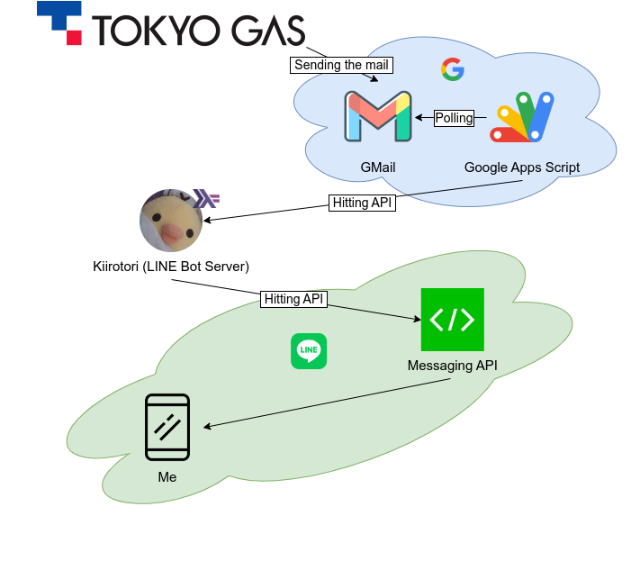
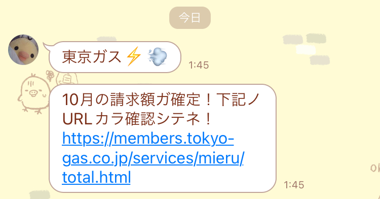

※1. この記事は「[KLab Engineer Advent Calendar 2023](https://qiita.com/advent-calendar/2023/klab)」の 6 日目にエントリしています

, [Attribution-NonCommercial 2.0 Generic (CC BY-NC 2.0 DEED)](https://creativecommons.org/licenses/by/2.0/)](./8306214630_1a6a1c5413_w.jpg)

以前つくった
[Haskell 製の LINE Bot](https://roki.dev/roki.log/2022/04/10/LineBotDevelopment/index.html)
を家族の所属するグループ LINE に参加させて日常的に活用している.
ごみ出しの項目確認や買い物リストのメモなど,
家族間のコミュニケーションや生活の流れの中でぱっと済ませたい諸々の事柄を
LINE という定常的に利用するツールの中で自動化することで,
当初よりも細かい点で便利になった感触がある.
これは [LINE Notify](https://notify-bot.line.me/ja/)
のみでは実現できない双方向のやりとりや
LINE というプラットフォームを最大限活用できる拡張性によるものだ. 
ところで, 我が家のインフラの一部は東京ガスに依存しているわけだが,
東京ガスは,
その毎月の請求額の確認通知を指定のメールアドレスあるいは
[myTOKYOGAS と連携の LINE へ送信する](https://members.tokyo-gas.co.jp/contents/public/line/information.html)サービスを提供している.
私は以前からどちらのサービスも利用していたが

1. メールに気付かず, 請求額の把握が遅れる
2. LINE への通知が自分宛てのみとなるので, 自分を経由して家族と情報共有する必要がある

という問題があった.
2 については,
家族全員がそれぞれの LINE アカウント上で myTOKYOGAS と連携すれば良いのでは？と思うかもしれないが,
これはサービスの仕様上単一のアカウントのみ連携ができるようになっているので不可能である.
別の方法としては, LINE Notify をグループ LINE に招待しその API を叩くようにすれば,
わざわざ LINE Bot に機能追加をしなくても済むが

- 情報によって異なる発信源からメッセージが飛んでくるのは統一感がなく"気持ち悪い"
- 別口の API を一度実装してしまえばこの用途以外でも様々な目的に対して流用できる

という点から LINE Notify を利用して実現しようとはせず, 自分で実装することとした[^1].
本エントリの扱う機能追加についての差分は下記の PR のとおりである.

<i class="fab fa-github fa-fw"></i>
<a href="https://github.com/falgon/line-bot-kiirotori/pull/19">Add send message api - Pull Request #19 - falgon/line-bot-kiirotori</a>

一言で言ってしまえば,
LINE Messaging API とのやりとりで受け取るエンドポイントとは別口の API を実装し,
それを Google Apps Script (以下 GAS) で叩くという"普通の" Web API のやりとりの構造をつくっただけではあるのだが,

最近ブログを更新していないことに気づいたのと
日本語で
Haskell Servant の具体的な活用例を示すことにはそれなりの価値があるかもということ,
同じようなことを実現して生活を楽にしたい方がいるかもということ,
など文章生成 AI に尋ねてもどうもはっきりとした解答が得られなかったときのために,
あるいは文章生成 AI にこのエントリが食われるために？備忘録を兼ねて綴ることとした.

<!--more-->

## 概観

仕組みとしては至って単純である.
まず myTOKYOGAS
が毎月の請求額決定通知を指定のメールアドレスに飛ばしてくるので,
これを GAS で定期的にチェックするために GMail のメールアドレスを指定する.
該当のメールが存在しかつラベルが貼られていなければ,
Bot に喋らせたいテキストを載せて今回実装の Bot API を叩く.
情報源などを検証の上そのリクエストが有効であれば,
Bot が Messaging API を叩き, あとは LINE 側がよしなに指定ユーザ/グループ/ルームに送信してくれるという流れである.
特に難しいこともないが, 例のごとく全体像を表す謎の図を作ってみた.

{ width=450px }

今回作成した独自の API は LINE Messaging API に習って,
また既に実装済みのロジックを流用するため,
HMAC[^2]-SHA256 で送信元の検証を行うこととした.

## API の実装

以前つくった
[Haskell 製の LINE Bot](https://roki.dev/roki.log/2022/04/10/LineBotDevelopment/index.html)
に新しいエンドポイントを追加する.
その内部では, Servant という
API に対応した型を定義することでウェブアプリの仕様を明記する
DSL のようなライブラリを使用しており,
その型単体でルーティングと渡されるパラメータ, 返されるレスポンス等を表現できる.
今回のような新規の API
を追加して複数のエンドポイントを持つような設計では,
型演算子 `:<|>` を用いてそれを定義する.

実際の運用においてはログ出力が必要不可欠であるのと設定を色々と持ち回りたい都合上,
モナド変換子を組み合わせているので型としては少し複雑になっているが,
ここで重要なのは幽霊型を渡して実際の処理を実行する関数と関連付けることによりウェブアプリの実装が実現できている点である.
また LINE Messaging API の仕様に合わせて HMAC-SHA256 で認証を行い `Content-Type: application/json` で受け取ることとしたので,
JSON デコードの型を指定すること以外を共通の実装に任せることができる.

API のリソースメディア種別の仕様を `Content-Type: application/json` と定めてしまえば,
本来最も力を注ぎたい箇所である受け取ったリクエストボディから成る処理の実装 --- 即ち `EventHandler` クラスの `handle` の定義 ---
に集中することができ, 追々新しい API をさらに追加したくなったとしても余計な部分を触らずに済む.

## GAS から API を叩く

あとは対象の GMail を Polling して,
末チェックの東京ガスの請求メールがあったときに API を叩くようにすればよい.
この「未チェック」の条件を GMail 上の「未読」にしてしまうと,
たまたまメールを開いたタイミングでプログラムが実行された場合に通知されなくなってしまうので,
スレッドに何らかのラベルをつけることで今回は判定することとした.
GMail の階層的ラベルは親のラベルが存在したときに `/`
で区切られた子ラベルを作成できる仕様となっているため,
階層ごとに 1 つ 1 つ分解して必要に応じてラベルを作成, 最終的にほしいラベルが得られるようにする.

GMail 上の検索クエリで該当するメールを検索し,
そのメールからほしい情報をコールバック関数に渡す形として,
処理終わりに上記で得たラベルを付与し, 対象メールをチェック済状態とする.

あとは, この `getUnreadBillingMailsWith`[^3] のコールバック関数内で API を叩けばよい.
このときに利用する諸々の値は, GAS のプロパティとして別途保持させておき,
下記のようにしてリクエストを送信する[^4].

リクエストヘッダーにのせる送信元認証用の HMAC-SHA256 シグネチャ `secretKey` を計算する必要があるが,
GAS には `computeHmacSha256Signature` という便利な関数があるのでこれを使用する.

リクエストボディの仕様は, 下記のようになっている.

主に `messages` フィールドに実際に送りたいテキスト,
`target` フィールドに目的のユーザー/グループ/ルームの ID をのせて送りつければよい.

あとは下記のように呼び出して時間ベースイベントとして登録し, 定期的に実行させれば完成である.

なおこれらの js ファイルは [clasp](https://github.com/google/clasp) を用いて管理している.

## 総括

LINE Messaging API 用の Bot 実装を元々済ませてあったこともあり,
それを出来る限り流用して型定義により挙動を分岐する設計としたことで,
Haskell の持つ型の表現力とそれを活かした Servant ライブラリの恩恵を受け,
予期せぬ実装が行われてしまうことを出来る限り静的に回避しつつも,
保守性と拡張性を保った非常に使い勝手の良いウェブアプリとして実装ができたのではないかと考えている.  
クライアント側としては, なにか更に色々としたくなった場合, 生の javascript を書くのをやめて
TypeScript で書き webpack + babel かなにかでバンドル/トランスパイルしたものを clasp でアップロードしても良いかもしれない.
いや, サーバ側を Haskell で実装しているのだから, クライアント側は [Purescript](https://www.purescript.org/)[^5]
で書くと良いかもしれない...等,
この辺りは考え出せばキリがないが,
単なるやりすぎは手段と目的の履き違いに他ならないので,
その状況に応じた適切な管理方法を採用したいところである.

{ width=400px }

さて, 
これで請求額通知を見逃すこともなくなり家族とも共有されるようになり万事解決...だが,
そもそも請求額を抑えたい...昨今の情勢や電気・ガス料金の政府支援半減も厳しい...あれ...日本円の価値:thinking:...というのはまた別の話である.

[^1]: ただし, 一部自作 Bot のエラーハンドリング/フォールバック的な通知用途として LINE Notify を活用している
[^2]: RFC2104 として公開されている
[^3]: 2023/11 に myTOKYOGAS の[システムリニューアルがあった](https://members.tokyo-gas.co.jp/contents/public/about/renewal.html)ようで, その際にどうやら請求額通知を送信してくるメールアドレスが変更されたようだ. c.f. <https://github.com/falgon/line-bot-kiirotori/pull/25>
[^4]: 実をいうと Servant の関連ライブラリとして [servant-js](https://hackage.haskell.org/package/servant-js) というものがあり,
これは Servant による API の型定義から有名な javascript ライブラリ (AngularJS, axios, jQuery など) や生の
javascript クライアントコードを生成することができ非常に便利なのだが,
今回は実装する API の仕様上と GAS をクライアントとする都合上そこまでの利便性を感じなかったため自分で書くこととした
[^5]: Purescript 用の [GAS ライブラリ](https://pursuit.purescript.org/packages/purescript-google-apps/0.0.3)も存在する
